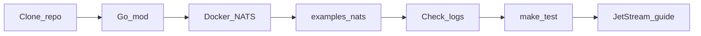

# Getting started

Diagram-first setup: clone → dependencies → local JetStream → demos → tests → deeper docs.

Shortcut path: `make nats-up && make demo-nats` (`make help` lists all targets).



## What this repo is

JetStream client for Go. Telemetry lives in a separate module: [`github.com/gopherust-io/tel`](https://github.com/gopherust-io/tel).

| Package | Import | Role |
|---------|--------|------|
| `nats` | `github.com/gopherust-io/nats` | JetStream client (publish, consume, streams) |
| `nats/workerpool` | `github.com/gopherust-io/nats/workerpool` | Fixed-size pool used by push consumers |
| `nats/idempotency` | `github.com/gopherust-io/nats/idempotency` | Consume-side dedup (KV / Bloom) |
| `nats/dlq` | `github.com/gopherust-io/nats/dlq` | Dead-letter + autopsy middleware |
| `nats/shadow` | `github.com/gopherust-io/nats/shadow` | Shadow/canary dual-run middleware |
| `nats/shard` | `github.com/gopherust-io/nats/shard` | Stable subject sharding helpers |

How messages move once NATS is up: [How JetStream works](nats/README.md#how-jetstream-works).

## Prerequisites

| Tool | Version / note |
|------|----------------|
| Go | **1.26+** (see `go.mod`) |
| Docker | For Compose JetStream (or install `nats-server -js` on the host) |
| OTLP collector | Optional, default `127.0.0.1:4317` |

## Step 1 — Dependencies

```bash
go mod download
```

## Step 2 — Start local JetStream

```bash
make nats-up
```

## Step 3 — Run the demo

```bash
make demo-nats
```

## Step 4 — Tests

```bash
make test
make test-race
```

## Next

- [JetStream guide](nats/README.md)
- [Recipes](nats/recipes.md)
- [Performance](performance.md)
