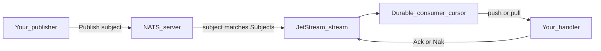
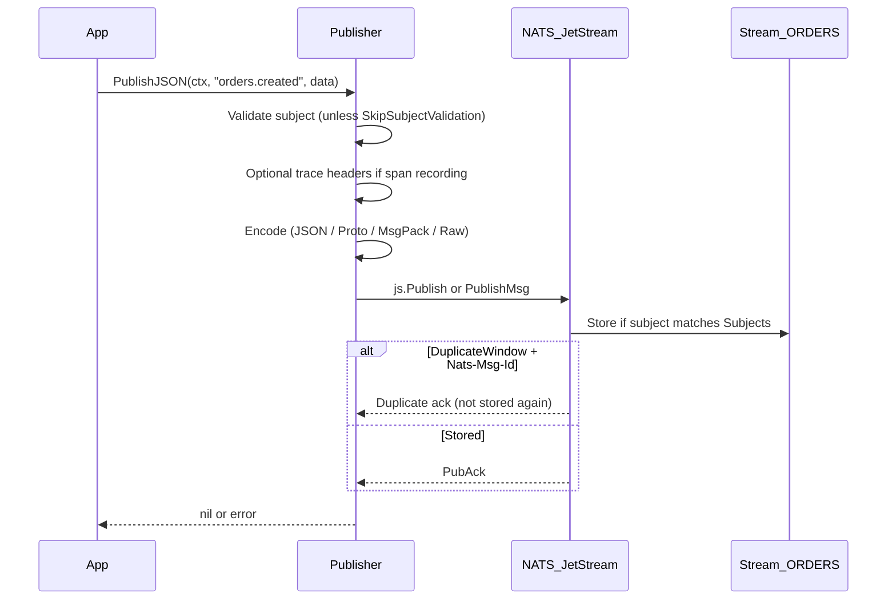
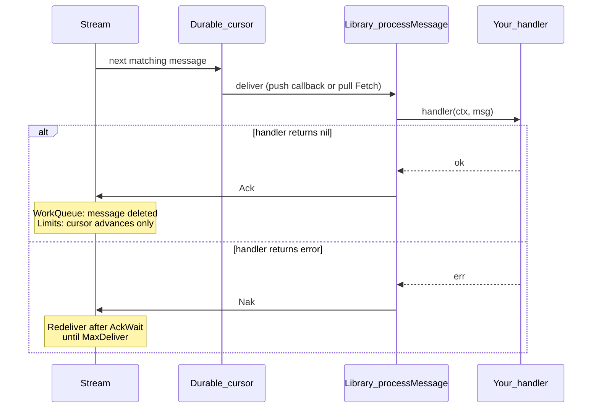
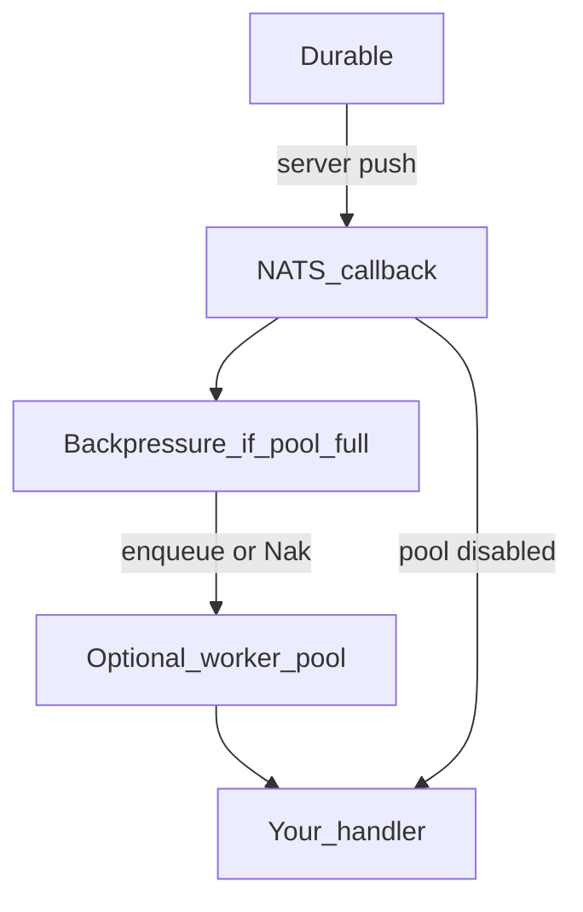
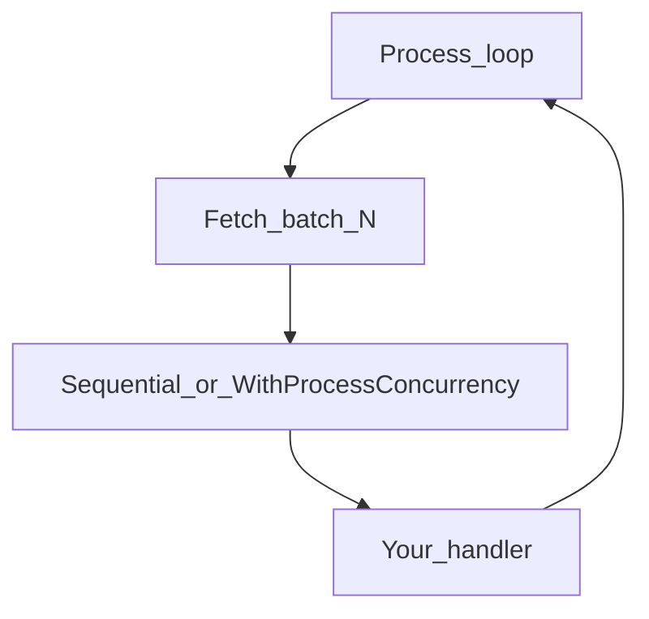
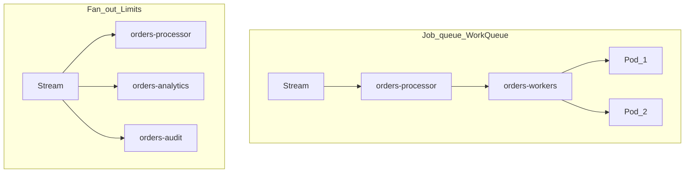

# NATS JetStream Guide

How publishing, consuming, and JetStream storage work in `github.com/gopherust-io/nats`.

**New here?** Start with [Getting started](../getting-started.md) (setup diagrams), then continue below.

Start here if you already have NATS running and want the publish/consume model. Use the [index](#documentation-index) for deep dives (tuning, recipes, Docker).

---

## How JetStream works

### Big picture in 30 seconds



1. You **publish** to a subject (for example `orders.created`).
2. If a **stream** lists a matching pattern in `Subjects`, JetStream **stores** the message.
3. A **durable consumer** is a named cursor on that stream (filter + ack rules).
4. Your app **subscribes** (push) or **fetches** (pull); the library **Acks** on success and **Naks** on handler error.

Core NATS pub/sub is fire-and-forget. This library is **JetStream-first**: persistence, redelivery, and ack are the default model.

---

## Documentation index

| Guide | Read when you need… |
|-------|---------------------|
| [Streams & subjects](streams-and-subjects.md) | Retention, what gets stored, delete vs cursor |
| [Consumers & binding](consumers-and-binding.md) | Create durables, bind push/pull, filters |
| [Push vs pull](push-vs-pull.md) | Which delivery model + tuning knobs |
| [Consumer tuning guide](consumer-tuning-guide.md) | Progressive worker/pool/backpressure tuning |
| [Optimal setups](optimal-setups.md) | Starting values by workload pattern |
| [Recipes](recipes.md) | Copy-paste production configs |
| [Production operations](devops.md) | Client + server: HA cluster/supercluster, security, resilience, performance |
| [Scaling](scaling.md) | Queue groups, DeliverGroup / K8s replicas, pull replicas, sharding |
| [Idempotency](idempotency.md) | Publish Msg-Id + consume-side dedup |
| [Naming conventions](naming-conventions.md) | Stream / durable / queue naming |
| [API reference](api-reference.md) | Helpers, DefaultConfig, supervisor, DLQ; leaf packages `dlq` / `shadow` / `shard` |
| [Performance](../performance.md) | Max-QPS recipe, codecs, alloc tips |
| [Local Docker](local-docker.md) | Compose labs (nats-console `docker/nats`) |

Runnable demo: [`examples/nats/`](../../examples/nats/) · Compose labs: [nats-console `docker/nats`](https://github.com/gopherust-io/nats-console/tree/main/docker/nats)

---

## End-to-end publish flow

What happens on every `Publisher().Publish*` call:



### Publish APIs (pick one)

| API | Payload | Notes |
|-----|---------|-------|
| `PublishJSON` | any → JSON | Default; good for debugging |
| `PublishProto` | `proto.Message` | Fastest / smallest |
| `PublishMsgPack` | any → MessagePack | Binary without `.proto` |
| `PublishBytes` | `[]byte` | Pre-encoded; skips codec |
| `PublishWithMsgID` / `PublishBytesWithMsgID` | + dedup id | Needs stream `DuplicateWindow` |
| `PublishAsync` / `PublishAsyncBytes` | async | Drain with `PublishAsyncComplete` |

```go
// Typical publish
err := client.Publisher().PublishJSON(ctx, "orders.created", order)

// Dedup (at-least-once publish retries)
err = client.Publisher().PublishWithMsgID(ctx, "orders.created", "order-42", libnats.Message{
    Data: order, MessageType: libnats.JSON,
})
```

**Important:** if no stream captures the subject, JetStream does **not** retain the message. Always create a stream whose `Subjects` cover what you publish (see [Streams & subjects](streams-and-subjects.md)).

---

## End-to-end consume flow

Consuming is always: **stream → durable → your handler → Ack/Nak**.



### Push consume (server pushes to you)

Best for always-on workers and low latency.



```go
// One-liner bind (creates/uses durable interest)
sub, err := client.Consumer().QueueSubscribeBound(ctx,
    "ORDERS", "orders-processor", "orders-workers", "orders.>", handler)

// Or SetupWorker: stream + subscribe in one call
sub, err = client.SetupWorker(ctx, libnats.WorkerSetup{...}, handler)
```

Typical runtime knobs (`RuntimeConsumerConfig`):

- `WorkerPoolEnabled` / `WorkerPoolSize` / `WorkerBufferSize` — parallel handlers
- `AckWait` — must be **2–3×** p99 handler time
- `Backpressure.Mode` — `Nak` for bursty job queues, `Block` for strict paths

### Pull consume (you fetch batches)

Best for ETL, bulk indexing, and explicit rate control.



```go
// Pull durables must be pre-created via CreateOrUpdateConsumer
_, _ = client.Consumers().CreateOrUpdateConsumer(ctx, "ORDERS", libnats.DurableConsumerConfig{
    Durable: "orders-puller", FilterSubject: "orders.>",
    MaxAckPending: 1000, MaxWaiting: 512,
})

pull, _ := client.Consumer().Pull("ORDERS", "orders-puller")
err := pull.Process(ctx, handler,
    libnats.WithFetchBatch(100),
    libnats.WithProcessConcurrency(8), // optional parallel within batch
)
```

Details and tuning tables: [Push vs pull](push-vs-pull.md).

---

## Job queue vs fan-out (retention)

This is the most common design choice.

| Goal | Retention | Topology |
|------|-----------|----------|
| One worker processes each job | `WorkQueuePolicy` | **One** durable + **queue group** |
| Every service sees every event | `LimitsPolicy` | **One durable per service** (no shared queue across services) |



- **WorkQueue + Ack** → message **removed** from the stream.
- **Limits + Ack** → only **that durable’s cursor** advances; message remains for other durables / replay.

Do **not** put multiple durables on WorkQueue for the same job — they compete for the same messages.

---

## Durable vs queue group (not Kafka consumer groups)

| Term | Meaning here |
|------|----------------|
| **Durable** | Named JetStream consumer = one cursor |
| **Queue group** | Competing processes on **the same** durable (each message → one member) |
| **DeliverGroup** | JetStream field for that queue name on a **push** consumer (library: `queue` arg on `QueueSubscribe*`) |
| **Separate durables** | Independent cursors (fan-out) |

Scaling pods with the same durable does not create more durables — see [Scaling](scaling.md#kubernetes-scale-does-not-multiply-durables).

---

## Message lifecycle cheat sheet

| Event | What JetStream does |
|-------|---------------------|
| Publish (stored) | Message appended to stream |
| Deliver to app | In-flight until Ack / Nak / Term |
| Handler success | Library **Ack** |
| Handler error | Library **Nak** → redelivery after `AckWait` |
| No Ack before `AckWait` | Automatic redelivery |
| `MaxDeliver` exhausted | Stop (optionally route with [`WithDLQ`](recipes.md#recipe-g--dead-letter-dlq--subscription-supervisor)) |
| Publish with same `Nats-Msg-Id` inside `DuplicateWindow` | Duplicate; not stored again |

---

## Library mapping

| Concept | API |
|---------|-----|
| Connect | `NewClient(ctx, &cfg)` |
| Publish | `client.Publisher().Publish*` |
| Manage stream | `nats stream add` / `client.Streams().CreateOrUpdateStream` |
| Manage durable | `client.Consumers().CreateOrUpdateConsumer` |
| Push workers | `Consumer().QueueSubscribeBound` / `SetupWorker` / `SuperviseQueueSubscribeBound` |
| Pull | `Consumer().Pull` → `Fetch` / `Process` |
| Replay | `client.Replay()` |
| Ack / Nak | Automatic in `processMessage` |

**Binding rule:** stream name, durable name, and subscribe filter must agree. Prefer `*SubscribeBound` helpers so `BindStream` + `Durable` are applied for you. See [Consumers & binding](consumers-and-binding.md).

---

## Minimal working example

```go
cfg := libnats.DefaultConfig()
cfg.Conn.Address = "nats://127.0.0.1:4222"

client, err := libnats.NewClient(ctx, &cfg)
if err != nil { /* ... */ }
defer client.Connector().Shutdown()

// Provision stream via CLI in production; examples may call CreateOrUpdateStream:
_, _ = client.Streams().CreateOrUpdateStream(ctx, libnats.StreamConfig{
    Name: "ORDERS", Subjects: []string{"orders.>"},
    Retention: libnats.WorkQueuePolicy, Replicas: 1,
})

// Publish
_ = client.Publisher().PublishJSON(ctx, "orders.created", map[string]any{"id": 1})

// Consume (competing workers)
_, err = client.Consumer().QueueSubscribeBound(ctx,
    "ORDERS", "orders-processor", "orders-workers", "orders.>",
    func(ctx context.Context, msg *nats.Msg) error {
        // process msg.Data — return nil to Ack, error to Nak
        return nil
    })
```

Production starting points: [Optimal setups](optimal-setups.md) · [Recipes](recipes.md) · [Consumer tuning](consumer-tuning-guide.md).

---

## Quick decisions

**Delivery model**

```
Always-on, low latency?  → Push + optional worker pool + queue group
Batch / ETL / rate control? → Pull + WithFetchBatch (+ concurrency)
```

**Retention**

```
One worker per message?     → WorkQueuePolicy + one durable + queue
Every service needs a copy? → LimitsPolicy + one durable per service
```

**Codec**

```
Debug / interop → JSON
No .proto       → MessagePack
Max throughput  → Protobuf or PublishBytes
```

**Config recipe**

```
Local          → DefaultConfig + no reconnect / metrics off
Prod job queue → DefaultConfig + job-worker knobs (+ WorkQueue stream)
Prod fan-out   → DefaultConfig + Block backpressure (+ Limits stream)
Max QPS / load → job-worker knobs + metrics off  (see Performance guide)
```

---

## Connection resilience

`DefaultConfig()` uses unlimited reconnect (`MaxReconnect: -1`), a 16 MiB reconnect publish buffer, and faster stale detection. Local/CI recipes typically disable reconnect.

- `Connector().WaitConnected(ctx)` — wait through flaps
- `ReconnectBufSize: -1` — fail publish immediately while disconnected (no buffer)

Details: [API reference — Connector](api-reference.md#connector).
