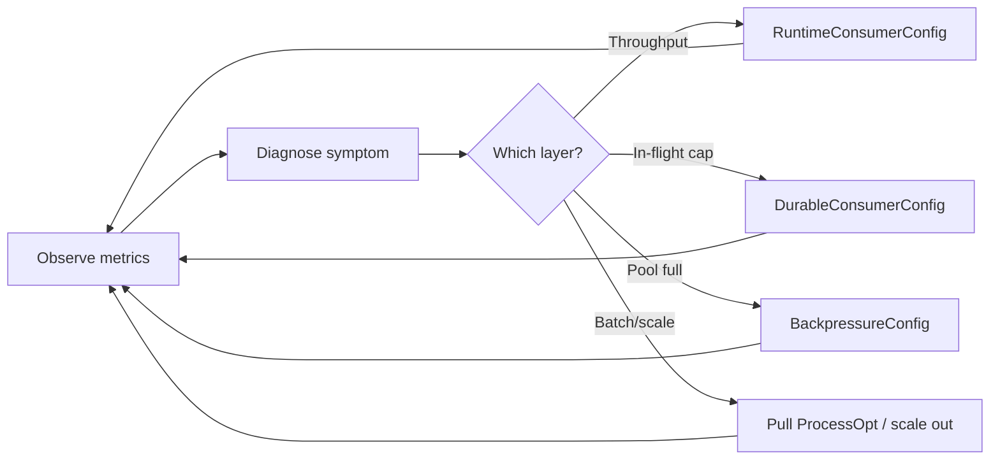
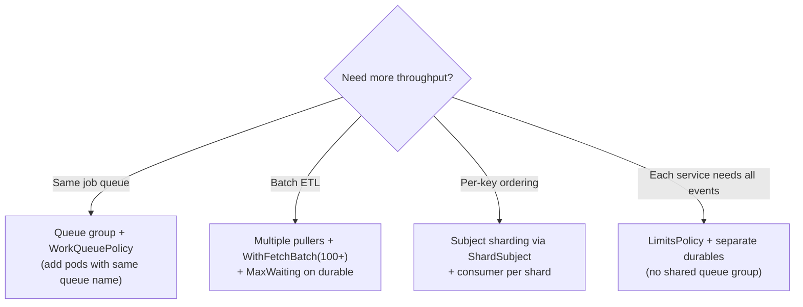

# Consumer Tuning Guide

Progressive tuning for **consume** paths (push handler / pull `Process`). Start from `DefaultConfig()`, apply a recipe below, measure, change one layer at a time.

Understand the delivery model first: [How JetStream works](README.md) · [Push vs pull](push-vs-pull.md). Copy-paste baselines: [Optimal setups](optimal-setups.md) · [Recipes](recipes.md). Demo: [`examples/nats/`](../../examples/nats/).



---

## 1. Start from DefaultConfig + recipe

Use [`DefaultConfig()`](../../nats/config.go) as the only factory, then set fields for your pattern:

### Job queue (competing workers)

```go
cfg := libnats.DefaultConfig()
cfg.RuntimeConsumer.WorkerPoolEnabled = true
cfg.RuntimeConsumer.WorkerPoolSize = 8
cfg.RuntimeConsumer.WorkerBufferSize = 256
cfg.RuntimeConsumer.AckWait = 45 * time.Second
cfg.RuntimeConsumer.PendingMsgLimit = 1000
cfg.RuntimeConsumer.PendingMsgBuffer = 10 << 20 // 10 MiB
cfg.Backpressure.Mode = libnats.BackpressureNak
cfg.Backpressure.MaxAckPending = 1000

stream := libnats.StreamConfig{
    Name: "ORDERS", Subjects: []string{"orders.>"},
    Storage: libnats.FileStorage, Retention: libnats.WorkQueuePolicy,
    Replicas: 3, Discard: libnats.DiscardOld, // Replicas: 1 for local lab
}
```

### Fan-out / event bus

```go
cfg := libnats.DefaultConfig()
cfg.Backpressure.Mode = libnats.BackpressureBlock
cfg.Backpressure.MaxAckPending = 500

stream := libnats.StreamConfig{
    Name: "EVENTS", Subjects: []string{"events.>"},
    Storage: libnats.FileStorage, Retention: libnats.LimitsPolicy,
    Replicas: 3, Discard: libnats.DiscardOld,
}
```

### Local / CI

```go
cfg := libnats.DefaultConfig()
cfg.Conn.AllowReconnect = false
cfg.Conn.RetryOnFailedConnect = false
cfg.Conn.InitialRetryAttempts = 1
// AllowMetrics / AllowTracing off on Conn, Publisher, Requester, Responder, RuntimeConsumer, Metrics
cfg.RuntimeConsumer.WorkerPoolEnabled = true
cfg.RuntimeConsumer.WorkerPoolSize = 2
cfg.RuntimeConsumer.WorkerBufferSize = 32
```

Max QPS (metrics off, SkipSubjectValidation, Lite): [Performance](../performance.md).

<a id="adaptive-pressure"></a>

### Adaptive Pressure (optional)

Instead of hand-tuning `WithFetchBatch` / living with binary Nak, enable:

```go
cfg.AdaptivePressure = libnats.AdaptivePressureConfig{Enabled: true}
```

The controller shrinks fetch batch and applies `NakWithDelay` as pool fill / lag rises, and opens the window when idle. Keep `WithFetchBatch(N)` when you need a fixed batch for a specific Process loop.
---

## 2. Universal rules (apply first)

These apply to **both** push and pull:

| Knob | Rule |
|------|------|
| `AckWait` | Set to **2–3× p99 handler time** in both `RuntimeConsumerConfig.AckWait` and `DurableConsumerConfig.AckWait` (they should match) |
| `MaxAckPending` | Start **500–1000**; raise if workers idle but lag grows; lower if memory pressure |
| `WorkerPoolSize` | **GOMAXPROCS** for CPU-bound; **2× cores** for I/O-bound |
| `WorkerBufferSize` | **4–8× WorkerPoolSize** for bursty traffic (e.g. 8 workers → 256 buffer) |
| Codec | Protobuf for throughput (~4× faster than JSON per [README benchmarks](../../README.md#codec-comparison-benchmarks)) |
| `PayloadDecompression` | Leave **on** (DefaultConfig) if publishers may set `Content-Encoding`; cost is only paid on compressed messages |

Large bodies: `PublisherConfig` / `RequesterConfig` / `ResponderConfig` `PayloadCompression` (`Off` / `Auto` / `Gzip` / `Brotli`) — see [Performance § Payload compression](../performance.md#payload-compression-nats-consol-parity). Use `Responder().Respond*` for compressed replies.

Pre-warm telemetry AttrCache for known subjects at process start to avoid cold-path allocations:

```go
for _, s := range []string{"orders.created", "orders.>"} {
    tel.Registry().AttrCache().SubjectOpts(s)
}
```

For max QPS with observability minimized, apply the max-QPS recipe in [Performance](../performance.md).


### Measuring p99 handler time

1. Enable metrics (`AllowMetrics: true`) and observe handler duration histograms.
2. Run under representative load for at least one full traffic cycle.
3. Set `AckWait = 2–3 × p99` in **both** runtime and durable config.

```go
const handlerP99 = 15 * time.Second // replace with measured p99

ackWait := handlerP99 * 3 // 2–3× rule

cfg.RuntimeConsumer.AckWait = ackWait
durableCfg.AckWait = ackWait
```

The [`examples/nats/config.go`](../../examples/nats/config.go) helper `ackWaitForHandler` encodes this rule.

---

## 3. Layer-by-layer tuning knobs

### Layer A — Runtime (client-side) [`RuntimeConsumerConfig`](../../nats/config.go)

**Push consumers:**

```go
cfg.RuntimeConsumer.WorkerPoolEnabled = true
cfg.RuntimeConsumer.WorkerPoolSize    = 8
cfg.RuntimeConsumer.WorkerBufferSize  = 256
cfg.RuntimeConsumer.AckWait           = 45 * time.Second
cfg.RuntimeConsumer.IdleHeartbeat     = 5 * time.Second  // non-queue push only; 0 for queue groups
cfg.RuntimeConsumer.FlowControl       = true             // pair with IdleHeartbeat
cfg.RuntimeConsumer.PendingMsgLimit   = 1000
cfg.RuntimeConsumer.PendingMsgBuffer  = 10 << 20         // 10 MiB
```

**Pull consumers:** keep `WorkerPoolEnabled = false`; the `Process` loop is the worker. Parallelism comes from batch size + multiple puller processes.

### Layer B — Durable (server-side) [`DurableConsumerConfig`](../../nats/config.go)

```go
libnats.DurableConsumerConfig{
    MaxAckPending: 1000,   // max unacked in-flight
    AckWait:       45 * time.Second,
    MaxDeliver:    5,      // poison message limit
    RateLimit:     0,      // bits/sec throttle (set if upstream needs cap)
    MaxWaiting:    512,    // concurrent pull requests (pull only)
    Heartbeat:     5 * time.Second,  // must match RuntimeConsumer.IdleHeartbeat for push
    FlowControl:   true,
}
```

**Push:** durable is created at subscribe time — pass `AckWait` via `RuntimeConsumerConfig` (library adds `nats.AckWait` on bind). Do **not** pre-create push durables via `CreateOrUpdateConsumer` (creates a pull consumer and breaks bound subscribe).

**Pull:** durable **must** be pre-created via [`ConsumerManager.CreateOrUpdateConsumer`](../../nats/consumer_manager.go).

### Layer C — Backpressure (push only) [`BackpressureConfig`](../../nats/backpressure.go)

When the worker pool buffer is full:

| Mode | Behavior | Use when |
|------|----------|----------|
| `BackpressureBlock` | Blocks NATS callback thread | Critical/financial paths, no silent loss |
| `BackpressureNak` | NAK immediately, redeliver later | Bursty job queues (job-worker recipe) |
| `BackpressureTerm` | Terminal ack, skip message | Poison messages after `MaxDeliver` |
| `BackpressureDrop` | Term + log (leaves Ack-pending) | Explicit opt-in lossy path |

```go
cfg.Backpressure.Mode          = libnats.BackpressureNak
cfg.Backpressure.MaxAckPending = 1000
```

| Workload | Recommended mode |
|----------|------------------|
| Job queue / bursty workers | `BackpressureNak` |
| Financial / audit / no silent loss | `BackpressureBlock` |
| Poison after max retries | `BackpressureTerm` (via DLQ handler) |

### Layer D — Pull fetch/process options [`consumer_pull.go`](../../nats/consumer_pull.go)

```go
pull.Process(ctx, handler,
    libnats.WithFetchBatch(100),              // default: 10
    libnats.WithProcessMaxWait(3*time.Second), // default: 5s
    libnats.WithProcessHeartbeat(500*time.Millisecond),
)
```

**Concurrency:** pull `Process` supports `WithProcessConcurrency(n)` (fixed worker set per batch) and can share the consumer worker pool. For more throughput, increase batch size, concurrency, and/or run multiple puller processes on the same durable. Opt-in `AdaptivePressure` can vary batch size automatically.

---

## 4. Metrics to drive iteration

Enable metrics (`AllowMetrics: true`) and watch these in [`nats/metrics.go`](../../nats/metrics.go):

| Metric | What it tells you |
|--------|-------------------|
| `worker_queue_depth` | Pool saturation — if near `WorkerBufferSize`, increase pool or switch to `BackpressureNak` |
| `slow_consumer_events` | NATS client is falling behind — reduce in-flight or increase processing capacity |
| `consumer_stall` | Backlog growing without successful processing (use `WatchSoftLiveness` for queue groups) |
| `slow_consumer_detected` | Sustained pending / lag / ack-pending ratio breach (`WatchSlowConsumer`) |
| `behavior_fingerprint_anomaly` | Throughput near baseline but handling latency ≥ factor × learned normal (`WatchBehaviorFingerprint`) |
| `idle_heartbeat_misses` | Push subscription went stale — wrap with `Supervise*` |
| `fetch_batch_size` / `fetch_wait_seconds` | Pull efficiency — tune batch vs timeout |
| ack/nak/redelivery counters | Handler errors or `AckWait` too short |

Configure lag tracking:

```go
cfg.Metrics.TrackedConsumers = []libnats.TrackedConsumer{
    {Stream: "ORDERS", Durable: "orders-processor"},
}
```

For incidents, attach a [`FlightRecorder`](../../nats/flight_recorder.go) to capture supervisor/stall/DLQ events. See [`examples/nats/worker.go`](../../examples/nats/worker.go).

---

## 5. Symptom → fix cheat sheet

### Push

| Symptom | First adjustment | Then try |
|---------|------------------|----------|
| Growing lag, idle workers | Increase `WorkerPoolSize` | Add queue group replicas |
| NAK/redelivery storms | Increase `AckWait` | Fix handler errors; check `MaxDeliver` |
| Memory pressure | Decrease `PendingMsgBuffer`, `WorkerBufferSize` | Lower `MaxAckPending` |
| Blocked NATS threads / slow consumer | Switch to `BackpressureNak` | Increase pool + buffer |
| Subscription invalid / HB miss | Add `SuperviseQueueSubscribeBound` | Tune `SupervisorConfig` backoff |

### Pull

| Symptom | First adjustment | Then try |
|---------|------------------|----------|
| High fetch latency | Increase `WithFetchBatch` | Decrease `WithProcessMaxWait` |
| Consumer overwhelmed | Decrease batch size | Lower `MaxAckPending` |
| Underutilized workers | Increase batch size | Add pull replicas; raise `MaxWaiting` |
| Idle timeouts in metrics | Normal on empty streams | Increase `WithProcessMaxWait` |

Full tables: [Push vs pull](push-vs-pull.md).

---

## 6. Scaling beyond config knobs

When single-process tuning is exhausted, scale horizontally per [Scaling](scaling.md):



### Push scale (queue groups)

```bash
# Same queue name = competing workers on one durable
ROLE=worker go run ./examples/nats   # pod 1
ROLE=worker go run ./examples/nats   # pod 2
```

### Pull scale (multiple pullers)

```bash
ROLE=puller go run ./examples/nats   # puller 1
ROLE=puller go run ./examples/nats   # puller 2
```

Tune `MaxWaiting` on the pull durable for concurrent fetch requests.

---

## 7. Progressive tuning workflow

Follow this loop each time you tune further:

1. **Baseline** — start from `DefaultConfig()` + job-worker or fan-out recipe matching your pattern
2. **Measure p99 handler time** — set `AckWait = 2–3× p99`
3. **Right-size the pool** — start at `GOMAXPROCS`, watch `worker_queue_depth`
4. **Set backpressure mode** — `Nak` for job queues, `Block` for critical paths
5. **Align server + client** — `DurableConsumerConfig` and `RuntimeConsumerConfig` should agree on `AckWait`, `MaxAckPending`
6. **Add supervision** — `SuperviseQueueSubscribeBound` + `WatchSoftLiveness` + `WatchBehaviorFingerprint` for production queue groups
7. **Scale out** — queue group replicas (push) or multiple pullers (pull) before further config tweaks
8. **Shard if needed** — subject sharding when single-stream throughput hits ceiling

---

## 8. Known library limits (when config alone is not enough)

These are architectural constraints, not missing config fields:

- Pull `Process` has **no worker pool** — parallel handling must be in your handler or via multiple pullers
- Queue groups **cannot** use `IdleHeartbeat` / `FlowControl` (nats.go limitation)
- No client-side rate limiter — only server-side `DurableConsumerConfig.RateLimit` (bits/sec)
- Multi-filter pull subjects without common prefix uses only the first filter ([`consumer_filter.go`](../../nats/consumer_filter.go))

If you hit these ceilings, the next step is scaling (section 6) or handler-level parallelism, not more config fields.

---

## Related guides

| Guide | Topics |
|-------|--------|
| [Optimal setups](optimal-setups.md) | Pattern-specific starting values |
| [Production operations](devops.md) | Client + server: HA cluster/supercluster, security, resilience |
| [Push vs pull](push-vs-pull.md) | Delivery model decision + tuning tables |
| [Scaling](scaling.md) | Queue groups, pull scale, subject sharding |
| [Recipes](recipes.md) | Full copy-paste configs |
| [examples/nats/](../../examples/nats/) | Runnable worker + puller with all layers applied |
