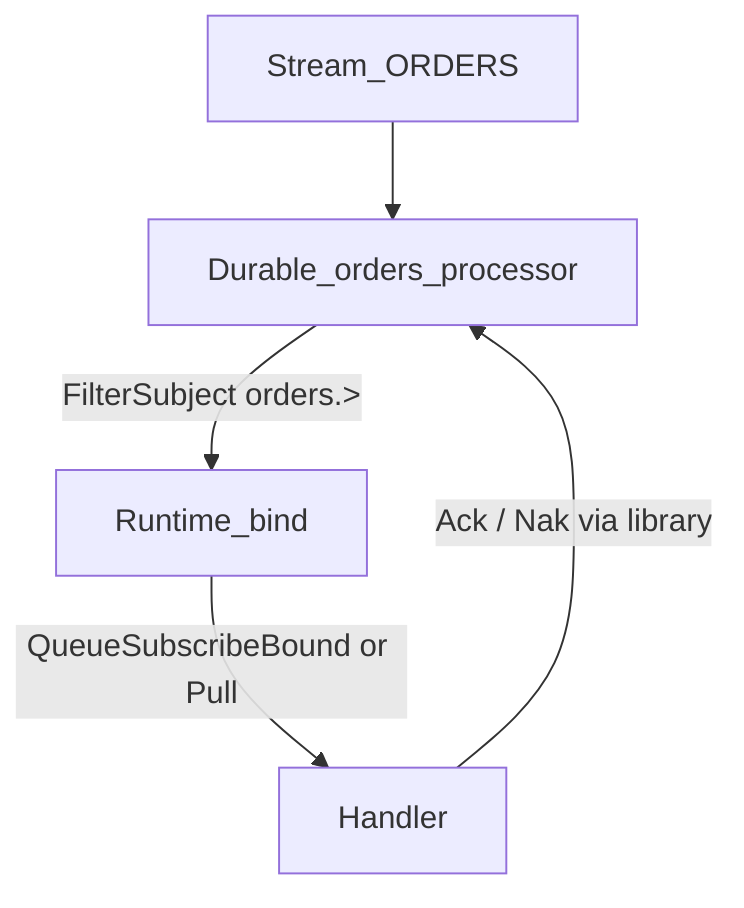
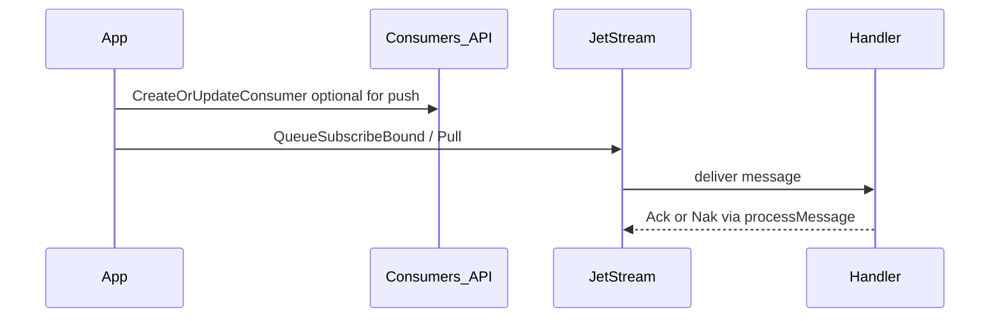

# Consumers & Binding

A JetStream **consumer** (usually a **durable**) decides **which** stored messages you see and **how** they are delivered. Your app then **binds** to that durable with push subscribe or pull fetch.

Overview of publish + consume: [How JetStream works](README.md). Delivery models: [Push vs pull](push-vs-pull.md).

## Consume flow (binding)



**Two steps**

1. **Define the durable** (filter, ack wait, max deliver, pull `MaxWaiting`, …) — via `CreateOrUpdateConsumer`, or let push subscribe create it.
2. **Bind at runtime** — `QueueSubscribeBound` / `SubscribeBound` (push) or `Pull` → `Process` (pull durables must be created first).



## Creating a durable consumer

```go
_, err := client.Consumers().CreateOrUpdateConsumer(ctx, "ORDERS", libnats.DurableConsumerConfig{
    Durable:       "orders-processor",
    FilterSubject: "orders.>",
    AckPolicy:     libnats.AckExplicit,
    MaxAckPending: 500,
    AckWait:       30 * time.Second,
    MaxDeliver:    5,
    DeliverPolicy: libnats.DeliverNew,
    ReplayPolicy:  libnats.ReplayInstant,
})
```

### Key fields (`DurableConsumerConfig`)

| Field | Purpose |
|-------|---------|
| `Durable` | Stable consumer name (required) |
| `FilterSubject` | Single subject filter |
| `FilterSubjects` | Multiple subject filters (see below) |
| `AckPolicy` | `AckExplicit` (default), `AckAll`, `AckNone` |
| `MaxAckPending` | Max unacknowledged messages |
| `AckWait` | Redelivery timeout for unacked messages |
| `MaxDeliver` | Max delivery attempts before stop |
| `DeliverPolicy` | `DeliverNew`, `DeliverAll`, `DeliverByStartSequence`, etc. |
| `Heartbeat` | Idle heartbeat for **non-queue** push (must match `RuntimeConsumer.IdleHeartbeat` when binding) |
| `FlowControl` | Enable for high-throughput non-queue push (pair with Heartbeat) |
| `InactiveThreshold` | Server deletes consumer after this idle period with no interest |
| `RateLimit` | Bits-per-second delivery limit |
| `MaxWaiting` | Max pull requests waiting (pull consumers) |

Defaults applied by the library when unset: `AckExplicit`, `ReplayInstant`.

`CreateOrUpdateConsumer` **does not** delete-and-recreate on deliver-policy changes (returns `ErrConsumerRecreateRequired`). Delete explicitly or use `Replay().ResetConsumer` for intentional seeks.

When using `SubscribeBound`, `DefaultConfig` sets `RuntimeConsumer.IdleHeartbeat=5s` and `FlowControl=true`. Pre-created durables should set matching `Heartbeat` / `FlowControl`, or let subscribe create the durable. **Queue subscribe cannot use idle heartbeat** (nats.go limitation).

## Can a consumer subscribe to several subjects?

**Yes** — at the JetStream consumer level via `FilterSubjects`:

```go
client.Consumers().CreateOrUpdateConsumer(ctx, "ORDERS", libnats.DurableConsumerConfig{
    Durable: "orders-processor",
    FilterSubjects: []string{
        "orders.order.created",
        "orders.order.cancelled",
        "orders.order.updated",
    },
})
```

### Rules

| Rule | Detail |
|------|--------|
| Coverage | Every filter subject must match the stream's `Subjects` list |
| Single vs multi | Use either `FilterSubject` or `FilterSubjects`, not both |
| Push subscribe | Runtime subject must match the consumer filter (use the same wildcard or concrete subject) |
| Wildcard alternative | Prefer `FilterSubject: "orders.>"` when all events share a prefix |

### Push example (multi-subject via wildcard)

```go
// Consumer filter covers all order events.
FilterSubject: "orders.>",

// Runtime subscribe must match.
client.Consumer().QueueSubscribe(ctx, "orders-workers", "orders.>", handler,
    nats.BindStream("ORDERS"), nats.Durable("orders-processor"))
```

### Push example (multi-subject explicit list)

```go
FilterSubjects: []string{"orders.order.created", "orders.order.cancelled"},

// Subscribe with a subject that matches the filter.
// Use the broadest matching subject or wildcard agreed at creation time.
client.Consumer().Subscribe(ctx, "orders.order.created", handler,
    nats.BindStream("ORDERS"), nats.Durable("orders-processor"))
```

## Push binding checklist

1. Create durable with `CreateOrUpdateConsumer`.
2. Subscribe with matching subject + `nats.BindStream(stream)` + `nats.Durable(durable)`.
3. Library auto-applies `ManualAck()` and `AckWait` from `RuntimeConsumerConfig`.
4. Handler errors trigger NAK; success triggers ACK (in `processMessage`).

```go
_, err := client.Consumer().QueueSubscribe(ctx,
    "orders-workers",  // queue group (horizontal scale)
    "orders.>",       // must match consumer filter
    handler,
    nats.BindStream("ORDERS"),
    nats.Durable("orders-processor"),
)
```

### Common binding errors

| Error | Cause | Fix |
|-------|-------|-----|
| `subject does not match consumer` | Subscribe subject ≠ consumer filter | Align subjects |
| `must use pull subscribe to bind to pull based consumer` | Push subscribe on pull-only durable | Use `Pull()` or recreate consumer |
| `stream not found` | Stream not created | `CreateOrUpdateStream` first |

## Pull binding checklist

1. Create durable (pull consumers have no `DeliverSubject`).
2. `pull, err := client.Consumer().Pull(stream, durable)`.
3. Library reads `FilterSubject` from consumer info for `PullSubscribe`.
4. Use `Fetch` or `Process` loop.

```go
pull, err := client.Consumer().Pull("ORDERS", "orders-puller")
if err != nil {
    return err
}

// Batch fetch
msgs, err := pull.Fetch(ctx, 50, libnats.WithFetchMaxWait(2*time.Second))

// Or continuous processing
err = pull.Process(ctx, handler,
    libnats.WithFetchBatch(50),
    libnats.WithProcessMaxWait(2*time.Second),
)
```

## Known limitations

| Limitation | Impact | Workaround |
|------------|--------|------------|
| `Pull()` multi-filter subjects | When `FilterSubjects` share no common prefix, only the first filter is used for pull bind | Use a wildcard filter (`orders.>`) or separate durables per subject |
| No multi-message transactions | Cannot atomically publish/consume multiple messages | Use at-least-once + idempotent handlers (see [Idempotency](idempotency.md)) |
| Manager `ctx` not propagated | Stream/consumer CRUD ignores context cancellation | Use timeouts at application level |

**Resolved:** `PublishWithMsgID` / `Message.WithMsgID` for publish dedup; `Pull()` derives wildcard from `FilterSubjects` when subjects share a prefix.

## Consumer management API

```go
// Create or update
client.Consumers().CreateOrUpdateConsumer(ctx, stream, cfg)

// Inspect
info, _ := client.Consumers().ConsumerInfo(ctx, "ORDERS", "orders-processor")

// List
consumers, _ := client.Consumers().ListConsumers(ctx, "ORDERS")

// Pause / resume (requires JetStream v2 API)
client.Consumers().PauseConsumer(ctx, "ORDERS", "orders-processor", pauseUntil)
client.Consumers().ResumeConsumer(ctx, "ORDERS", "orders-processor")

// Delete
client.Consumers().DeleteConsumer(ctx, "ORDERS", "orders-processor")
```

## Multiple consumers on one stream

| Pattern | Durables | Retention | Delivery |
|---------|----------|-----------|----------|
| Fan-out | `orders-processor`, `orders-analytics` | `LimitsPolicy` | Each gets all messages |
| Work queue | `orders-processor` + queue group | `WorkQueuePolicy` | One worker per message |
| Filtered views | `orders-processor` (`orders.>`), `orders-audit` (`orders.order.created`) | `LimitsPolicy` | Independent filters |

Next: [Push vs pull](push-vs-pull.md)
