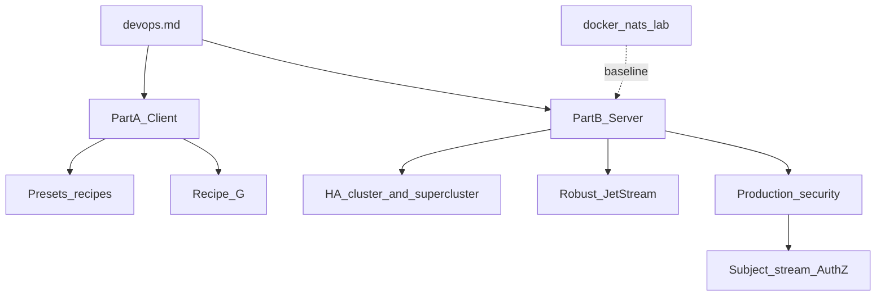
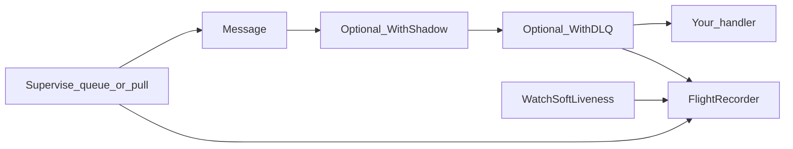
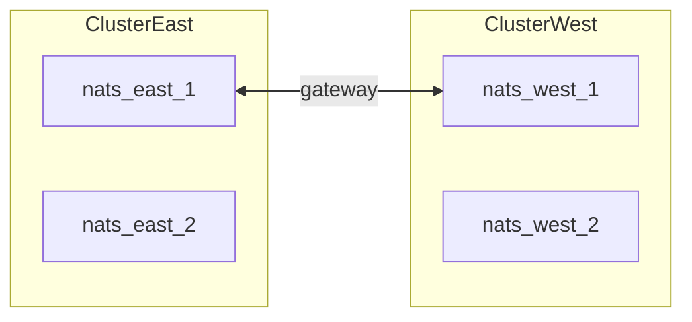
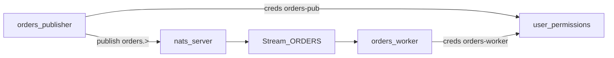

# NATS production operations

Production guide for **NATS server** topology (HA cluster / supercluster, robust JetStream, security) and for the **`github.com/gopherust-io/nats`** client (presets, resilience, performance, health).

- Client stream/consumer knobs: [Recipes](recipes.md), [Optimal setups](optimal-setups.md), [Consumer tuning](consumer-tuning-guide.md), [Performance](../performance.md)
- Local insecure labs: [Local Docker](local-docker.md) · [nats-console `docker/nats`](https://github.com/gopherust-io/nats-console/tree/main/docker/nats)



---

## Purpose & scope

| In scope | Out of scope |
|----------|--------------|
| HA cluster / supercluster patterns and annotated `nats-server` conf | Full JWT/`nsc` operator PKI ceremony |
| Robust JetStream store limits, domains, route/gateway mesh | Kubernetes NATS Operator / HPA YAML |
| Production security (TLS, authN/Z, **subject/stream permissions**, monitor lockdown) | Ready-made Grafana/Alertmanager packs |
| Per-service publish vs subscribe allow lists (JetStream-aware) | Promoting lab Compose files as production |
| Client presets, reconnect, probes, metrics, recovery | Exhaustive `$JS.API.*` matrix for every nats.go call |

**Do not** run the Compose stacks in this repo as production — they have no TLS or auth. Use them as labs; apply the server patterns below on your platform (VM, systemd, or operator).

| Part | Jump |
|------|------|
| [Part A — Client](#part-a--client-library) | App presets, resilience, performance, client TLS |
| [Part B — Server](#part-b--nats-server) | Topology, cluster, supercluster, security, ops checklist |
| [Subject / stream AuthZ](#4-subject-and-stream-authorization) | Who may publish or consume which subjects |

---

# Part A — Client library

## Choose a robust baseline

Start from a preset, then only override what your workload needs.

```
Workload?
├── Job queue / competing workers → ProdWorkerConfig()
│     WorkQueue + FileStorage + Replicas 3 + worker pool + BackpressureNak
├── Fan-out / event bus           → ProdFanOutConfig()
│     LimitsPolicy + FileStorage + Replicas 3 + BackpressureBlock
├── Max publish/consume QPS       → ThroughputConfig()
│     Same as ProdWorker + metrics/tracing off + Lite/FixedCardinality
│     → see Performance guide
└── Local laptop / CI             → DevConfig() or Recipe F
      Memory storage, Replicas 1, reconnect off
```

| Preset | Best for | Production defaults worth keeping |
|--------|----------|-----------------------------------|
| `ProdWorkerConfig()` | Job processors | `Replicas: 3`, `FileStorage`, WorkQueue, pool, Nak on full pool |
| `ProdFanOutConfig()` | Many independent durables | `Replicas: 3`, Limits, Block backpressure |
| `ThroughputConfig()` | Inner loops / load tests | Observability minimized; keep reconnect buffer unless fail-fast |
| `DefaultConfig()` | Custom streams | Same resilient reconnect as prod presets |
| `DevConfig()` | Dev only | No reconnect — do not ship |

Numbers by pattern: [Optimal setups](optimal-setups.md). Full configs: [Recipes](recipes.md). Connection defaults: [API reference](api-reference.md#connection-defaults-defaultconfig--prod-presets).

---

## High availability (client data + connection)

### Stream durability

| Knob | Production | Dev / lab |
|------|------------|-----------|
| `Replicas` | **3** (survives one node loss in a cluster) | `1` |
| `Storage` | `FileStorage` | `MemoryStorage` OK for local |
| Retention | WorkQueue (jobs) or Limits (events/audit) | Limits |

`Replicas: 3` requires a JetStream **cluster** ([Part B](#ha-cluster-configuration)). Drill failover with the [nats-console 5-node cluster lab](https://github.com/gopherust-io/nats-console/tree/main/docker/nats/cluster) (or run an odd-sized cluster with the conf shape below).

### Client connection HA

Prod presets (`DefaultConfig`, `ProdWorkerConfig`, `ProdFanOutConfig`, `ThroughputConfig`) use:

- Unlimited reconnect (`MaxReconnect: -1`)
- 16 MiB reconnect publish buffer (`ReconnectBufSize`)
- Ping / stale detection (`PingInterval` 20s, `MaxPingsOut` 3)
- `RetryOnFailedConnect: true`

| Goal | Setting |
|------|---------|
| Survive broker flaps | Keep unlimited reconnect; use `Connector().WaitConnected(ctx)` at startup |
| Fail publish while disconnected | `Conn.ReconnectBufSize = -1` (no buffer) |
| Prefer a primary URL order | Comma-separated `Conn.Address` + `DontRandomize: true` |
| Discoverability in `nats server report` | Set `Conn.ClientName` ([naming](naming-conventions.md#connection-client-names)) |

Details: [Connection resilience](README.md#connection-resilience).

---

## Resilient consumer stack (production checklist)

Full example: [Recipe G](recipes.md#recipe-g--dead-letter-dlq--subscription-supervisor).



**Checklist**

- [ ] Bound subscribe (`QueueSubscribeBound` / `SubscribeBound` / pull `Process`)
- [ ] `SuperviseQueueSubscribeBound` or `SupervisePullProcess`
- [ ] Queue workers: `WatchSoftLiveness` (IdleHeartbeat unavailable on queue groups)
- [ ] `FlightRecorder` attached to supervisor + soft liveness (+ DLQ/shadow when used)
- [ ] Poison path: `WithDLQ` + autopsy when errors must not loop forever
- [ ] Canary: `WithShadow` (primary owns Ack/DLQ)
- [ ] Correctness: publish `Nats-Msg-Id` + optional [idempotency](idempotency.md)

Runnable reference: [`examples/nats/`](../../examples/nats/).

---

## High performance configuration

| Lever | When |
|-------|------|
| `ThroughputConfig()` | Hot path; re-enable only the metrics you need |
| Protobuf / `PublishBytes` | Encode cost dominates |
| `SkipSubjectValidation` | Trusted static subjects (on in ThroughputConfig) |
| `Metrics.Lite` + `FixedCardinality` | Avoid gauge/subject cardinality tax |
| AttrCache warmup | Avoid cold-path alloc on first message per subject |
| Pull: larger batch + `WithProcessConcurrency(n)` | Ingest without per-message goroutine churn |
| Push: pool size / buffer + `BackpressureNak` | Keep JetStream threads healthy under overload |

Deep dive: [Performance](../performance.md). Iterate: [Consumer tuning](consumer-tuning-guide.md).

```bash
./scripts/bench-baseline.sh
# end-to-end: go run ./tools/loadtest ...
```

See [bench/README.md](../../bench/README.md) and [tools/loadtest](../../tools/loadtest/).

---

## Secure the client connection

Lab Compose has **no TLS/auth**. Wire credentials and TLS on `Config.Conn` to match [Part B — Production security](#production-security-approach).

**Auth — pick one** (library rejects conflicting combinations):

| Fields | Mechanism |
|--------|-----------|
| `User` + `Password` | Username/password (both required together) |
| `Secret` | Token auth |
| `Seed` | NKey seed |
| `CredentialsFile` | Operator JWT `.creds` / chained credentials file |

```go
cfg := libnats.ProdWorkerConfig()
cfg.Conn.Address = "nats://nats-1:4222,nats://nats-2:4222,nats://nats-3:4222"
cfg.Conn.User = os.Getenv("NATS_USER")
cfg.Conn.Password = os.Getenv("NATS_PASSWORD")
// Or: cfg.Conn.CredentialsFile = os.Getenv("NATS_CREDS")
```

**TLS / mTLS** via `Conn.TLS` (`ConnectionTLS`):

| Field | Use |
|-------|-----|
| `CA` | PEM CA pool to verify the server |
| `Cert` + `Key` | Client certificate pair (mTLS) |
| `ServerName` | Hostname for cert verification when dialing by IP |
| `Config` | Full `*tls.Config` (takes precedence over PEM fields) |
| `InsecureSkipVerify` | **Dev only** |

```go
cfg.Conn.TLS = libnats.ConnectionTLS{
    CA:   caPEM,
    Cert: clientCertPEM,
    Key:  clientKeyPEM,
}
```

---

## Health, probes, and lifecycle

| Call | Meaning |
|------|---------|
| `Connector().IsConnected()` | TCP/session up |
| `Connector().HealthCheck(ctx)` | Connected **and** JetStream `AccountInfo` when JS is available |
| `Connector().ConnectionStatus()` | `Connected`, `ReconnectCount`, `LastError`, `InLameDuck`, redacted `ServerURL` |
| `Connector().WaitConnected(ctx)` | Block until connected (startup / post-flap) |
| `Connector().Shutdown()` | Stop collectors → drain consumers → drain/flush connection (idempotent) |

Optional: `Conn.HealthCheckInterval` starts a background ticker that logs failed checks.

| Probe | Prefer | Why |
|-------|--------|-----|
| Readiness | `HealthCheck` succeeds | Do not take traffic if JetStream account calls fail |
| Liveness | Process alive; avoid restart on brief disconnect | Unlimited reconnect heals flaps; restart on **give-up / circuit** |

**Restart signals** (dump flight recorder first):

- `supervisor_give_up` / supervisor Events give-up
- Soft liveness stall with `CircuitStop: true`
- Sustained `InLameDuck` while the server drains (rolling restart)

**Shutdown order:** stop soft liveness/supervisors as your app manages them → `Connector().Shutdown()` → `tel` `Shutdown`.

---

## Monitoring and alerts

Default metric prefix: `nats`. Enable with `AllowMetrics: true` (on in prod presets; off in `ThroughputConfig` / `DevConfig`).

| Group | Metric (suffix) | Alert idea |
|-------|-----------------|------------|
| Connection | `lame_duck_events`, `connection_rtt_seconds` | Spike in lame-duck; RTT step-change |
| Publish | `publish_total` | Error rate vs baseline |
| Consume | `ack_total`, `nak_total`, `term_total`, `redelivery_total` | Rising Nak/redelivery |
| Pool / pressure | `worker_queue_depth`, `slow_consumer_events` | Depth near buffer; slow-consumer growth |
| Resilience | `resubscribe_total`, `supervisor_give_up`, `consumer_stall`, `slow_consumer_detected`, `behavior_fingerprint_anomaly` | Any give-up/stall/slow/fingerprint anomaly in prod |
| Canary | `shadow_error_total`, `shadow_mismatch_total` | Mismatch above canary threshold |
| Lag | `consumer_lag_messages`, `stream_messages` | Lag SLO breach |

```go
cfg.Metrics.TrackedConsumers = []libnats.TrackedConsumer{
    {Stream: "ORDERS", Durable: "orders-processor"},
}
```

OTLP: root [README — Telemetry](../../README.md#telemetry). Spans: [API reference — Tracing](api-reference.md#tracing). Symptom tables: [Consumer tuning §5](consumer-tuning-guide.md#5-symptom--fix-cheat-sheet).

---

## Recovery playbooks

### Poison message → DLQ autopsy

1. Handler errors until `MaxDeliver`, or returns `ErrSendToDLQ`.
2. `WithDLQ` publishes to the DLQ subject (+ optional autopsy headers), then Terms the original.
3. Inspect DLQ; fix handler; reprocess with a separate consumer.
4. Keep stream `DuplicateWindow` + `Nats-Msg-Id` for idempotent retries.

See [Recipe G](recipes.md#recipe-g--dead-letter-dlq--subscription-supervisor).

### Stall / invalid subscription → flight recorder

1. Soft liveness `consumer_stall` or supervisor resubscribe / give-up.
2. `FlightRecorder.WriteJSON(w)` (or `Snapshot`).
3. On give-up / `CircuitStop`, restart after the dump.
4. Check lag and handler errors before scaling out.

### Cursor / historical reprocess

[Recipe E](recipes.md#recipe-e--audit--replay), [API reference — Replay](api-reference.md#replay). Prefer a **new durable** over moving a live production cursor.

### Purge

Purge deletes stored messages — not a consumer reset: [Streams & subjects](streams-and-subjects.md).

---

## Scale-out (clients)

When a process is correctly tuned but lag still grows: add queue-group members, more pullers, or subject sharding — [Scaling](scaling.md). **Do not** HPA JetStream server peers to add capacity; keep an odd-sized Raft cluster and scale consumers instead ([Part B](#topology-decision)).

---

# Part B — NATS server

## Topology decision

| Topology | When | Lab (nats-console) |
|----------|------|-----|
| Single | Dev / CI only | [`docker/nats/single`](https://github.com/gopherust-io/nats-console/tree/main/docker/nats/single) |
| **HA cluster** (3 or 5 nodes) | Production JetStream + stream `Replicas: 3` / `5` | [`docker/nats/cluster`](https://github.com/gopherust-io/nats-console/tree/main/docker/nats/cluster) |
| **Supercluster** (gateways) | Multi-region / multi-AZ mesh | [`docker/nats/supercluster`](https://github.com/gopherust-io/nats-console/tree/main/docker/nats/supercluster) |

**Rules of thumb**

- Use an **odd** number of JetStream peers (3 or 5) for Raft quorum.
- **Do not** treat `nats-server` like a stateless Deployment you HPA up and down — changing peer count is a cluster membership change, not horizontal consumer scale.
- Scale **clients** (queue groups, pullers, shards) via [Scaling](scaling.md).
- Lab Compose: [Local Docker](local-docker.md). Production: apply the patterns below with TLS/auth on your platform.

---

## HA cluster configuration

Baseline (insecure lab): [nats-console `n1.conf`](https://github.com/gopherust-io/nats-console/blob/main/docker/nats/cluster/n1.conf) (same shape on peers with unique `server_name`).

```conf
# Lab shape — add TLS/auth before production (see Production security)
server_name: nats-1

listen: 0.0.0.0:4222
http: 0.0.0.0:8222   # lock down in prod

jetstream {
  store_dir: /data
  domain: hub          # same domain on every peer in this cluster
  max_mem_store: 512M
  max_file_store: 5G   # size to real disk; leave headroom
}

cluster {
  name: c1             # same cluster name on every peer
  listen: 0.0.0.0:6222
  routes: [
    nats://nats-1:6222
    nats://nats-2:6222
    nats://nats-3:6222
  ]
}
```

### Robust JetStream settings (production deltas vs lab)

| Concern | Production practice |
|---------|---------------------|
| Identity | Unique `server_name` per node; stable hostnames in `routes` |
| Domain | Shared JetStream `domain` across the HA cluster (lab uses `hub`) |
| Disk | One **persistent volume per node**; `store_dir` on that volume — never shared across peers |
| Caps | Set `max_file_store` / `max_mem_store` below real capacity; align stream `MaxBytes` / `MaxAge` from [recipes](recipes.md) |
| Routes | Full mesh (or equivalent reachable routes) on the cluster port |
| Clients | Advertise / load-balance client URLs; apps use a **multi-URL** `Conn.Address` |
| Streams | `Replicas: 3` + `FileStorage` for durable HA ([client HA](#high-availability-client-data--connection)) |

```go
cfg := libnats.ProdWorkerConfig()
cfg.Conn.Address = "nats://nats-1:4222,nats://nats-2:4222,nats://nats-3:4222"
// StreamConfig{ Replicas: 3, Storage: FileStorage, ... } — already in ProdWorkerConfig
```

Failover drill (lab): [nats-console 5-node cluster](https://github.com/gopherust-io/nats-console/tree/main/docker/nats/cluster).

---

## Supercluster configuration

Baseline: [nats-console east `n1.conf`](https://github.com/gopherust-io/nats-console/blob/main/docker/nats/supercluster/cluster-a/n1.conf) and [west `n1.conf`](https://github.com/gopherust-io/nats-console/blob/main/docker/nats/supercluster/cluster-b/n1.conf).

Each region is a normal **cluster**; regions link with **gateways**. JetStream **domains stay regional** (`east` / `west` in the lab) unless you add mirrors/sources.

```conf
# One node in region "east" — lab shape
server_name: nats-east-1

listen: 0.0.0.0:4222
http: 0.0.0.0:8222

jetstream {
  store_dir: /data
  domain: east         # distinct from west
  max_mem_store: 256M
  max_file_store: 2G
}

cluster {
  name: east
  listen: 0.0.0.0:6222
  routes: [
    nats://nats-east-1:6222
    nats://nats-east-2:6222
  ]
}

gateway {
  name: east
  listen: 0.0.0.0:7222
  gateways: [
    { name: west, urls: [nats://nats-west-1:7222, nats://nats-west-2:7222] }
  ]
}
```



**Production pattern**

| Topic | Practice |
|-------|----------|
| App connect | Point each service at **one region’s** client URL list (latency + blast radius) |
| Gateway HA | List multiple peer gateway URLs per remote cluster |
| JetStream geo | Domains are separate; use **mirrors / sources** for cross-region streams (ops cookbook — not covered here) |
| Security | TLS on client, route, **and** gateway ports ([below](#production-security-approach)) |

Lab: [nats-console mini supercluster](https://github.com/gopherust-io/nats-console/blob/main/docs/local-docker.md#mini-supercluster-2--2). Client scale notes: [Scaling — cluster capacity](scaling.md#cluster-capacity).

---

## Production security approach

Lab confs and Compose are **open** (no TLS, no auth, `http` on `0.0.0.0`). Harden in this order:

### 1. TLS on the client port

Terminate TLS on `listen` (port 4222). Clients use library `ConnectionTLS` ([Secure the client connection](#secure-the-client-connection)).

```conf
listen: 0.0.0.0:4222

tls {
  cert_file: "/etc/nats/tls/server-cert.pem"
  key_file:  "/etc/nats/tls/server-key.pem"
  ca_file:   "/etc/nats/tls/ca.pem"   # for mTLS verify
  verify:    true                     # require client certs when using mTLS
}
```

### 2. TLS on cluster routes and gateways

Encrypt the fabric so route/gateway traffic is not plaintext on the network.

```conf
cluster {
  name: c1
  listen: 0.0.0.0:6222
  tls {
    cert_file: "/etc/nats/tls/server-cert.pem"
    key_file:  "/etc/nats/tls/server-key.pem"
    ca_file:   "/etc/nats/tls/ca.pem"
  }
  routes: [ /* tls:// or nats:// depending on server version / config */ ]
}

gateway {
  name: east
  listen: 0.0.0.0:7222
  tls {
    cert_file: "/etc/nats/tls/server-cert.pem"
    key_file:  "/etc/nats/tls/server-key.pem"
    ca_file:   "/etc/nats/tls/ca.pem"
  }
  gateways: [ /* peer URLs */ ]
}
```

### 3. Authentication (pick one)

| Mechanism | Typical use |
|-----------|-------------|
| Username / password (bcrypt hashes in conf) | Simple single-account clusters |
| Token | Shared secret (prefer rotating via secret store) |
| NKeys | Strong key-based auth without passwords |
| Credentials file (`.creds`) | Operator JWT — set `Conn.CredentialsFile` on the client |
| Accounts + JWT (operator model) | Multi-tenant — full PKI via upstream NATS / `nsc` |

Wire the matching client fields (`User`/`Password`, `Secret`, `Seed`, or `CredentialsFile`). Do not combine mechanisms on the client ([nats/auth.go](../../nats/auth.go)).

### 4. Subject and stream authorization

Yes — JetStream **does** enforce least-privilege access. Enforcement is on the **`nats-server`**, not in this Go library. The library only presents credentials that map to a permitted user ([Secure the client connection](#secure-the-client-connection)).

**Model**

| Concept | What you configure |
|---------|-------------------|
| Stream name (`ORDERS`) | Created by an **admin** via JetStream API — not a first-class ACL object in classic `users` permissions |
| Stream `Subjects` (`orders.>`) | Messages land in the stream only if the client may **publish** those subjects |
| Consume | Worker needs **subscribe** on delivery subjects **plus** scoped `$JS.API.…` / `$JS.ACK.…` publish rights |
| Deny by default | Prefer explicit `allow` lists; avoid `publish: ">"` / `subscribe: ">"` on app users |



Aligned with this repo’s recipes (`ProdWorkerConfig` / [Recipe A](recipes.md#recipe-a--worker--job-processor)): stream `ORDERS`, subjects `orders.>`, durable `orders-processor`.

#### Role templates

Use **one user (or NKey) per service**. Passwords below are placeholders — store bcrypt hashes or NKeys in your secret manager. Exact `$JS.API.*` strings depend on create-vs-bind and push vs pull; start scoped and widen only when the client logs a permissions violation.

```conf
# Illustrative production fragment — not the lab Compose files
accounts {
  APP: {
    jetstream: enabled
    users: [
      {
        user: orders-pub
        password: "$2a$11$replace_with_bcrypt"
        permissions: {
          publish: [ "orders.>" ]
          subscribe: [ "_INBOX.>" ]   # PubAck / request-reply
          # No $JS.API.STREAM.> — publishers must not create streams
        }
      }
      {
        user: orders-worker
        password: "$2a$11$replace_with_bcrypt"
        permissions: {
          publish: [
            "$JS.API.CONSUMER.INFO.ORDERS.orders-processor"
            "$JS.API.CONSUMER.CREATE.ORDERS.orders-processor.orders.>"
            "$JS.ACK.ORDERS.>"
            "$JS.FC.>"
          ]
          subscribe: [
            "orders.>"
            "_INBOX.>"
          ]
          # Prefer bind-to-existing durable; avoid $JS.API.STREAM.>
        }
      }
      {
        user: js-admin
        password: "$2a$11$replace_with_bcrypt"
        permissions: {
          publish: [
            "$JS.API.STREAM.>"
            "$JS.API.CONSUMER.>"
            "orders.>"                 # optional: bootstrap smoke publish
          ]
          subscribe: [ "_INBOX.>", "$JS.API.>" ]
        }
      }
    ]
  }
}
```

| Role | May | Must not |
|------|-----|----------|
| `orders-pub` | Publish `orders.>` into stream `ORDERS` | Create/delete streams or consumers; subscribe to other teams’ subjects |
| `orders-worker` | Bind/consume durable `orders-processor`, Ack/Nak | Broad `$JS.API.>` (stream create/purge) |
| `js-admin` | Stream/consumer lifecycle (CI, platform bootstrap) | Be the runtime identity of app pods |

**Push vs pull / bind vs create:** if the worker only **binds** a pre-created durable, you can drop `CONSUMER.CREATE…` and keep `CONSUMER.INFO…` + `$JS.ACK.ORDERS.>`. If the app calls `CreateOrUpdateConsumer`, grant the matching `CONSUMER.CREATE` / `CONSUMER.DURABLE.CREATE` subjects for that stream and durable only. Upstream detail: [NATS Authorization](https://docs.nats.io/running-a-nats-service/configuration/securing_nats/authorization).

#### AuthZ validation matrix (lab)

Practice against [nats-console `docker/nats/auth`](https://github.com/gopherust-io/nats-console/tree/main/docker/nats/auth) (no TLS; local only):

| Client user | Should succeed | Should fail |
|-------------|----------------|-------------|
| `orders-pub` | `PublishMessage` / `PublishJSON` on `orders.created` | Create stream; subscribe as worker |
| `orders-worker` | Bind/consume after admin created stream+durable | Publish business events; `$JS.API.STREAM.CREATE.>` |
| `js-admin` | `CreateOrUpdateStream` / durable bootstrap | — (admin is broad by design in the lab) |

**Suggested drill**

1. In nats-console: `make nats-auth-up` (or `docker compose -f docker/nats/auth/docker-compose.yml up -d`)
2. As `js-admin`: create stream `ORDERS` + durable `orders-processor`
3. As `orders-pub`: publish; as `orders-worker`: consume
4. Swap creds and confirm permissions violations on the wrong role

Widen `$JS.API.*` only when the client logs a permissions violation for your exact push/pull/bind path.

#### Accounts (hard isolation)

- Put JetStream for a tenant/domain in its own **account** with `jetstream: enabled` (as `APP` above).
- Users in account A cannot see subjects or streams in account B unless you configure **exports/imports** (cross-account sharing — ops cookbook, not covered here).
- Prefer accounts when multiple teams share one cluster; prefer subject permissions within one account for publisher vs worker split on the same stream.

#### Client wiring (this library)

One process = one role. Map env secrets to `Config.Conn`:

```go
// orders-publisher service
cfg := libnats.ProdWorkerConfig() // or a publisher-focused preset
cfg.Conn.Address = "tls://nats-1:4222,tls://nats-2:4222,tls://nats-3:4222"
cfg.Conn.User = os.Getenv("NATS_USER")         // orders-pub
cfg.Conn.Password = os.Getenv("NATS_PASSWORD")

// orders-worker service — different credentials
cfg.Conn.User = os.Getenv("NATS_USER")         // orders-worker
cfg.Conn.Password = os.Getenv("NATS_PASSWORD")
```

NKey deployments use `Conn.Seed` instead of user/password. Do not ship a shared “superuser” in app workloads.

#### Pitfalls

| Mistake | Symptom / risk |
|---------|----------------|
| No `_INBOX.>` subscribe | Publish / JetStream API request-reply fails with permissions violation |
| Granting `$JS.API.>` to workers | Workers can create/delete streams and consumers |
| Only allowing `orders.>` for a consumer | Consume fails — need `$JS.ACK.…` and scoped `$JS.API.CONSUMER.…` |
| Authorizing by stream name alone | Classic conf authorizes **subjects** (and `$JS.*`), not `ORDERS` as an ACL key |
| Using lab Compose as-is | Open cluster — no AuthZ at all |

### 5. Lock down monitoring

Lab binds `http: 0.0.0.0:8222`. In production:

- Bind to localhost or a private admin interface, **or**
- Put the monitor behind VPN / mesh auth, **or**
- Use server monitoring auth if enabled in your NATS version

Do not expose `/varz` / `/jsz` to the public internet.

### 6. Never ship lab defaults

| Lab | Production |
|-----|------------|
| No auth | Required AuthN |
| No TLS | TLS (and mTLS where required) |
| Open subject space | Per-service publish/subscribe allow lists |
| `InsecureSkipVerify` on clients | Forbidden |
| Open monitor | Private / authenticated |

### 7. Rolling restart / lame-duck

- Prefer **lame-duck** mode so clients see `InLameDuck` / `lame_duck_events` and reconnect to peers.
- Drain one node at a time; wait for JetStream quorum healthy before the next.
- Keep client multi-URL lists so reconnect finds a live peer.

---

## Server ops checklist

- [ ] Topology chosen (3-node HA cluster minimum for `Replicas: 3`; supercluster only if multi-region needed)
- [ ] Persistent `store_dir` per node; `max_file_store` sized with headroom
- [ ] Shared JetStream `domain` inside the HA cluster; distinct domains across supercluster regions
- [ ] TLS on client + cluster (+ gateway if supercluster); AuthN/AuthZ enabled
- [ ] Separate users for publisher vs worker vs stream admin (no app user has `$JS.API.STREAM.>`)
- [ ] Subject allow lists cover business subjects **and** required `$JS.ACK` / `$JS.API.CONSUMER` / `_INBOX.>`
- [ ] Multi-tenant or multi-team clusters use separate JetStream **accounts** when hard isolation is required
- [ ] Monitor endpoint not public
- [ ] Client apps: multi-URL connect, `Replicas: 3`, TLS/creds matching the server role
- [ ] Health endpoints: `/healthz`, `/varz`, `/jsz` (lab example in [Local Docker](local-docker.md))
- [ ] Failover drill on lab cluster before cutover
- [ ] Stream retention bounds (`MaxBytes` / `MaxAge`) aligned with disk and [recipes](recipes.md)

These conf snippets are **templates**. Promote via your platform — do **not** treat [nats-console Compose labs](https://github.com/gopherust-io/nats-console/tree/main/docker/nats) as a production deploy.

**Still external:** full JWT operator ceremony (`nsc`), leaf-node designs beyond `Mirror`/`Sources`, disk backup tooling, and Kubernetes Operator manifests — use upstream NATS operations docs / your platform team.

---

## Related guides

| Guide | Topics |
|-------|--------|
| [Local Docker](local-docker.md) | Pointer to nats-console Compose labs |
| [Scaling](scaling.md) | Client scale-out; cluster capacity notes |
| [Optimal setups](optimal-setups.md) | Starting numbers by workload |
| [Recipes](recipes.md) | Copy-paste production **client** configs (incl. Recipe G) |
| [Consumer tuning](consumer-tuning-guide.md) | Progressive tuning + metrics |
| [Performance](../performance.md) | ThroughputConfig, codecs, alloc tips |
| [Idempotency](idempotency.md) | Msg-Id + consume-side dedup |
| [API reference](api-reference.md) | Connector, supervisor, DLQ, soft liveness |
| [nats-console `docker/nats`](https://github.com/gopherust-io/nats-console/tree/main/docker/nats) | Lab Compose + conf files |
