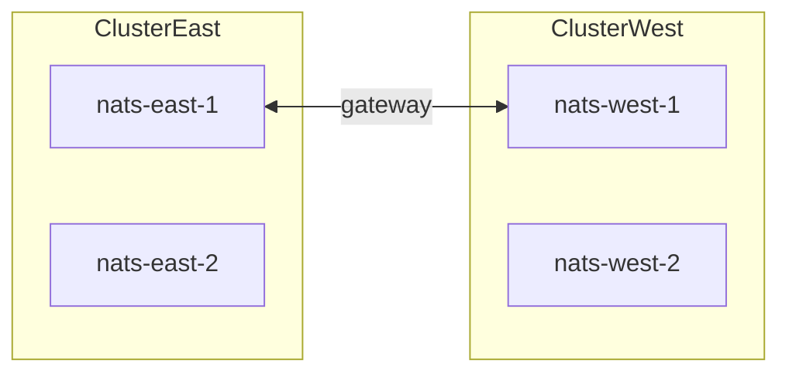

# Local NATS with Docker Compose

Run JetStream locally without installing `nats-server` on the host. Compose files live under [`docker/nats/`](../../docker/nats/).

After the server is up, walk through publish/consume with the [NATS JetStream Guide](README.md) or `go run ./examples/nats`.

**Not for production:** no TLS, no authentication. For HA cluster / supercluster patterns and a production security approach, see [Production operations — Part B Server](devops.md#part-b--nats-server). Client TLS/auth wiring: [Secure the client connection](devops.md#secure-the-client-connection).

## Quick compare

| Mode | Compose file | Client `Address` | Notes |
|------|--------------|------------------|-------|
| Single | [`docker/nats/single`](../../docker/nats/single/) | `nats://127.0.0.1:4222` | Everyday lib / examples |
| Cluster | [`docker/nats/cluster`](../../docker/nats/cluster/) | `nats://127.0.0.1:4222,nats://127.0.0.1:4223,nats://127.0.0.1:4224` | Test `Replicas: 3`, failover |
| Supercluster | [`docker/nats/supercluster`](../../docker/nats/supercluster/) | East `4222,4223` or West `4225,4226` | Gateways + JetStream domains |
| Auth (users) | [`docker/nats/auth`](../../docker/nats/auth/) | `nats://127.0.0.1:4222` + User/Password | Practice subject AuthZ |

Image: `nats:2.14` (aligned with test module; see [Compatibility](../compatibility.md)). Do not run **cluster** and **supercluster** together (port overlap on `4222`/`4223`). Auth stack also binds `4222` — stop other stacks first.

---

## Single server

```bash
docker compose -f docker/nats/single/docker-compose.yml up -d
curl -s http://127.0.0.1:8222/healthz
```

Library client:

```go
cfg := libnats.DevConfig() // or DefaultConfig()
cfg.Conn.Address = "nats://127.0.0.1:4222"
```

Use stream `Replicas: 1` (default / `DevConfig`).

Monitoring: [http://127.0.0.1:8222](http://127.0.0.1:8222) (`/varz`, `/jsz`, `/healthz`).

---

## 3-node cluster

```bash
docker compose -f docker/nats/cluster/docker-compose.yml up -d
```

- Shared JetStream domain: `hub`
- Host ports: clients `4222–4224`, monitors `8222–8224`
- One named volume per node (`js-n1` …) — required for JetStream clustering

Client URL list (leave `DontRandomize` false so reconnects can pick peers):

```go
cfg := libnats.DefaultConfig()
cfg.Conn.Address = "nats://127.0.0.1:4222,nats://127.0.0.1:4223,nats://127.0.0.1:4224"
// For HA streams matching ProdWorkerConfig-style setups:
// StreamConfig{ Replicas: 3, ... }
```

Optional CLI check (if [NATS CLI](https://github.com/nats-io/natscli) is installed):

```bash
nats --server nats://127.0.0.1:4222 server list
nats --server nats://127.0.0.1:4222 account info
```

---

## Mini supercluster (2 × 2)

Two clusters (`east`, `west`), two nodes each, linked by **gateways**. Distinct JetStream domains (`east` / `west`) so streams stay regional unless you add sources/mirrors.

```bash
docker compose -f docker/nats/supercluster/docker-compose.yml up -d
```

| Region | Client URLs | Monitor |
|--------|-------------|---------|
| East | `nats://127.0.0.1:4222,nats://127.0.0.1:4223` | `8222`, `8223` |
| West | `nats://127.0.0.1:4225,nats://127.0.0.1:4226` | `8225`, `8226` |

Connect apps to **one** region’s URL list (as you would in a geo deployment).

**Cross-region JetStream (mirrors / sources / leaf nodes):** this library exposes `StreamConfig.Mirror` and `StreamConfig.Sources` for basic mirror/source streams. Complex multi-domain leaf/geo setups remain a platform concern — configure with `nats` CLI / operator docs, or create streams via `Streams().CreateOrUpdateStream` with `Mirror`/`Sources` set. There is no separate “geo cookbook” in this repo beyond the [supercluster lab](#mini-supercluster-2--2) and [Production operations — Server](devops.md#part-b--nats-server).



---

## Tear down

```bash
docker compose -f docker/nats/single/docker-compose.yml down -v
docker compose -f docker/nats/cluster/docker-compose.yml down -v
docker compose -f docker/nats/supercluster/docker-compose.yml down -v
docker compose -f docker/nats/auth/docker-compose.yml down -v
```

`-v` removes JetStream data volumes.

---

## Examples in this repo

```bash
docker compose -f docker/nats/single/docker-compose.yml up -d
go run ./examples/nats
```

Unit/integration tests embed an in-process `nats-server` and do **not** require Docker.
