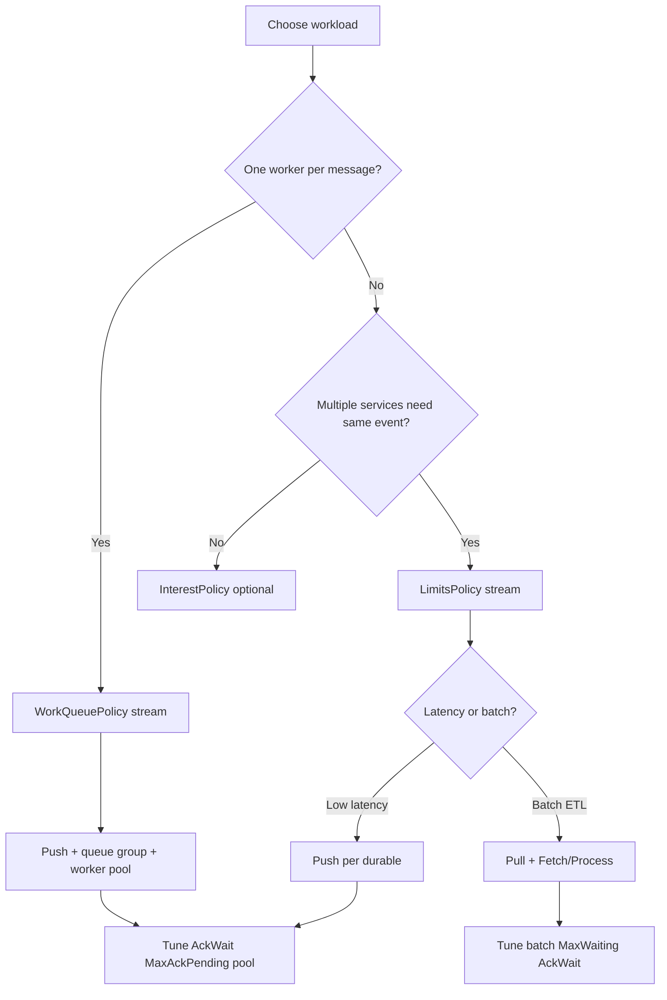

# Optimal Stream & Consumer Configurations

Starting values for [`StreamConfig`](../../nats/config.go), [`DurableConsumerConfig`](../../nats/config.go), and [`RuntimeConsumerConfig`](../../nats/config.go).

**Flows first:** [How JetStream works](README.md) · Copy-paste: [Recipes](recipes.md) · Tune after: [Consumer tuning guide](consumer-tuning-guide.md). This page is **why** + **starting numbers**.

## Decision flow



---

## Universal tuning rules

| Rule | Guideline |
|------|-----------|
| `AckWait` | Set to **2–3× p99 handler time** (`RuntimeConsumerConfig.AckWait` and `DurableConsumerConfig.AckWait` should match) |
| `MaxAckPending` | Start **500–1000**; raise if workers are idle but lag grows; lower if memory pressure |
| `WorkerPoolSize` | **GOMAXPROCS** for CPU-bound; **2× cores** for I/O-bound handlers |
| `WorkerBufferSize` | **4–8× WorkerPoolSize** for bursty traffic (e.g. 8 workers → 256 buffer) |
| `Replicas` | **1** dev/local; **3** production (survives node loss) |
| `Storage` | `MemoryStorage` dev; `FileStorage` prod |
| Codec | **Protobuf** for throughput (~4× faster than JSON per [README benchmarks](../../README.md#codec-comparison-benchmarks)) |

---

## Pattern 1: Job queue / competing workers

**Use when:** background jobs, order processing, exactly-one active worker per message.

### Stream

```go
libnats.StreamConfig{
    Name:      "ORDERS",
    Subjects:  []string{"orders.>"},
    Replicas:  3,
    Storage:   libnats.FileStorage,
    Retention: libnats.WorkQueuePolicy, // critical: one delivery per message
    MaxAge:    72 * time.Hour,
    Discard:   libnats.DiscardOld,
}
```

### Durable consumer

```go
libnats.DurableConsumerConfig{
    Durable:       "orders-processor",
    FilterSubject: "orders.>",
    AckPolicy:     libnats.AckExplicit,
    MaxAckPending: 1000,
    AckWait:       45 * time.Second,
    MaxDeliver:    5,
    DeliverPolicy: libnats.DeliverNew,
    FlowControl:   true,
}
```

### Runtime

```go
cfg.RuntimeConsumer.WorkerPoolEnabled = true
cfg.RuntimeConsumer.WorkerPoolSize    = 8
cfg.RuntimeConsumer.WorkerBufferSize  = 256
cfg.RuntimeConsumer.AckWait           = 45 * time.Second
cfg.RuntimeConsumer.PendingMsgLimit   = 1000
cfg.RuntimeConsumer.PendingMsgBuffer  = 10 << 20

cfg.Backpressure.Mode          = libnats.BackpressureNak // redeliver when pool full
cfg.Backpressure.MaxAckPending = 1000
```

**Subscribe:** `QueueSubscribe` with queue group `orders-workers` + `BindStream` + `Durable`.

See [Recipe A](recipes.md#recipe-a--worker--job-processor).

---

## Pattern 2: Fan-out / event bus

**Use when:** analytics, audit, and processing each need every event.

### Stream

```go
libnats.StreamConfig{
    Name:      "ORDERS",
    Subjects:  []string{"orders.>"},
    Replicas:  3,
    Storage:   libnats.FileStorage,
    Retention: libnats.LimitsPolicy, // each durable gets its own copy
    MaxAge:    30 * 24 * time.Hour,
    MaxBytes:  10 << 30,
    Discard:   libnats.DiscardOld,
}
```

### Durable consumers (one per downstream service)

```go
// Processor — all events
libnats.DurableConsumerConfig{
    Durable: "orders-processor", FilterSubject: "orders.>",
    DeliverPolicy: libnats.DeliverNew, MaxAckPending: 500,
    AckWait: 30 * time.Second, FlowControl: true,
}

// Analytics — all events
libnats.DurableConsumerConfig{
    Durable: "orders-analytics", FilterSubject: "orders.>",
    DeliverPolicy: libnats.DeliverNew, MaxAckPending: 500, AckWait: 30 * time.Second,
}

// Audit — subset only
libnats.DurableConsumerConfig{
    Durable: "orders-audit", FilterSubject: "orders.order.created",
    DeliverPolicy: libnats.DeliverNew, MaxAckPending: 200, AckWait: 30 * time.Second,
}
```

### Runtime

- Per-service `WorkerPoolEnabled` based on handler cost (light handlers: pool off; CPU-heavy: pool on).
- **No shared queue group** across services — each durable is independent.
- `BackpressureBlock` if you cannot tolerate silent drops.

See [Recipe B](recipes.md#recipe-b--fan-out--event-bus).

---

## Pattern 3: High-consistency / financial events

**Use when:** payments, transfers — at-least-once + idempotent handlers (no multi-message ACID in JetStream).

### Stream

```go
libnats.StreamConfig{
    Name:            "PAYMENTS",
    Subjects:        []string{"payments.>"},
    Replicas:        3,
    Storage:         libnats.FileStorage,
    Retention:       libnats.LimitsPolicy,
    DuplicateWindow: 2 * time.Minute, // publish dedup via Nats-Msg-Id header
    MaxAge:          90 * 24 * time.Hour,
    Discard:         libnats.DiscardOld,
}
```

### Durable consumer

```go
libnats.DurableConsumerConfig{
    Durable:       "payments-processor",
    FilterSubject: "payments.>",
    AckPolicy:     libnats.AckExplicit,
    MaxAckPending: 500,
    AckWait:       60 * time.Second,
    MaxDeliver:    3, // limit poison-message retries
    DeliverPolicy: libnats.DeliverNew,
}
```

### Runtime

```go
cfg.RuntimeConsumer.WorkerPoolEnabled = true
cfg.RuntimeConsumer.WorkerPoolSize    = 4
cfg.RuntimeConsumer.AckWait           = 60 * time.Second

cfg.Backpressure.Mode = libnats.BackpressureBlock // never drop under load
```

**Publish dedup:** set `Message.Header["Nats-Msg-Id"]` with a business-level unique ID.

**Optional:** switch to `WorkQueuePolicy` if exactly one worker must process each payment.

See [Recipe C](recipes.md#recipe-c--high-consistency--financial-style-processing).

---

## Pattern 4: High-throughput ingestion (pull)

**Use when:** ETL, bulk indexing, bursty producers, explicit rate control.

### Stream

```go
libnats.StreamConfig{
    Name:      "EVENTS",
    Subjects:  []string{"events.>"},
    Replicas:  3,
    Storage:   libnats.FileStorage,
    Retention: libnats.LimitsPolicy,
    MaxBytes:  50 << 30,
    Discard:   libnats.DiscardOld,
}
```

### Durable consumer (pull)

```go
libnats.DurableConsumerConfig{
    Durable:       "events-ingester",
    FilterSubject: "events.>", // use wildcard; Pull() ignores FilterSubjects
    MaxAckPending: 1000,
    AckWait:       120 * time.Second,
    MaxWaiting:    512, // concurrent pull requests
    RateLimit:     0,   // set bits/sec if upstream needs throttle
}
```

### Runtime

```go
cfg.RuntimeConsumer.WorkerPoolEnabled = false // Process loop is the worker

pull.Process(ctx, handler,
    libnats.WithFetchBatch(100),
    libnats.WithProcessMaxWait(3*time.Second),
)
```

Scale by running multiple pull processes on the same durable.

See [Recipe D](recipes.md#recipe-d--high-throughput-ingestion-pull--batch).

---

## Pattern 5: Audit / replay

**Use when:** long retention + ability to reprocess from a sequence.

### Stream

```go
libnats.StreamConfig{
    Name:      "ORDERS",
    Subjects:  []string{"orders.>"},
    Replicas:  3,
    Storage:   libnats.FileStorage,
    Retention: libnats.LimitsPolicy,
    MaxAge:    365 * 24 * time.Hour,
    Discard:   libnats.DiscardOld,
}
```

### Consumers

```go
// Live processor
libnats.DurableConsumerConfig{
    Durable: "orders-processor", FilterSubject: "orders.>",
    DeliverPolicy: libnats.DeliverNew,
}

// Audit / replay (resettable)
libnats.DurableConsumerConfig{
    Durable: "orders-audit", FilterSubject: "orders.>",
    DeliverPolicy: libnats.DeliverAll,
}
```

**Replay:**

```go
// Seek existing audit durable (preserves MaxAckPending / AckWait / filters)
_, _ = client.Replay().ResetConsumer(ctx, stream, durable,
    libnats.WithFilterSubject("orders.>"), libnats.FromSeq(seq))

// Or create a side-car durable so the live processor is untouched
temp, _ := client.Replay().CreateReplayConsumer(ctx, stream, "orders-processor",
    libnats.FromSeq(seq), libnats.UntilSeq(seq+100), libnats.Limit(101))

// Peek / export without moving any consumer cursor
msg, _ := client.Replay().GetMsg(ctx, stream, seq)
rangeMsgs, truncated, _ := client.Replay().GetMsgRange(ctx, stream, seq, seq+10)
_ = temp.Durable
_ = msg
_ = rangeMsgs
_ = truncated
```

See [Recipe E](recipes.md#recipe-e--audit--replay).

---

## Pattern 6: Development / local

```go
// Prefer: nats stream add DEV_ORDERS --subjects 'orders.>' --storage memory
// Or bootstrap in labs only:
_, _ = client.Streams().CreateOrUpdateStream(ctx, libnats.StreamConfig{
    Name: "DEV_ORDERS", Subjects: []string{"orders.>"},
    Replicas: 1, Storage: libnats.MemoryStorage,
})

cfg.RuntimeConsumer.WorkerPoolEnabled = true
cfg.RuntimeConsumer.WorkerPoolSize    = 2
cfg.RuntimeConsumer.WorkerBufferSize  = 32

// Disable metrics on all paths
cfg.Metrics.AllowMetrics = false
cfg.Conn.AllowMetrics = false
cfg.PublisherConfig.AllowMetrics = false
cfg.RuntimeConsumer.AllowMetrics = false
cfg.Conn.AllowReconnect = false // wires NoReconnect()
```

Or use `libnats.DevConfig()` which applies the same reconnect/metrics defaults (`NewClient` still does not create streams).

### Production connection knobs (inherited from `DefaultConfig`)

| Field | Value | Why |
|-------|-------|-----|
| `MaxReconnect` | `-1` | Survive long outages |
| `ReconnectBufSize` | `16 MiB` | Buffer sync publishes across flaps |
| `PingInterval` / `MaxPingsOut` | `20s` / `3` | Faster dead-peer detection |
| `RetryOnFailedConnect` | `true` | Bootstrap through brief unavailability |

See [API reference — Connection defaults](api-reference.md#connection-defaults-defaultconfig--prod-presets).

See [Recipe F](recipes.md#recipe-f--development--local).

---

## Backpressure mode cheat sheet

| Mode | When to use |
|------|-------------|
| `BackpressureBlock` (default) | Financial/critical paths; strict ordering; no silent loss |
| `BackpressureNak` | Worker pools under burst; prefer redelivery over blocking NATS threads |
| `BackpressureTerm` | Poison messages after `MaxDeliver` exhausted |
| `BackpressureDrop` | Rare; explicit opt-in lossy path only |

Details: [Push vs pull — backpressure](push-vs-pull.md#backpressure-backpressureconfig).

---

## Quick-reference matrix

| Pattern | Retention | Delivery | Worker pool | MaxAckPending | Backpressure |
|---------|-----------|----------|-------------|---------------|--------------|
| Job queue | WorkQueue | Push + queue | On (8) | 1000 | nak |
| Fan-out | Limits | Push per durable | Optional | 500 | block |
| High-consistency | Limits + dedup | Push | On (4) | 500 | block |
| Ingestion | Limits | Pull | Off | 1000 | n/a |
| Audit/replay | Limits | Push/Pull | Optional | 200 | block |
| Dev | Limits | Push | On (2) | 500 | nak |

---

## Related guides

| Guide | Topics |
|-------|--------|
| [Production operations](devops.md) | Client + server: HA cluster/supercluster, security, resilience |
| [Consumer tuning guide](consumer-tuning-guide.md) | Progressive workflow, metrics, symptom → fix |
| [Recipes](recipes.md) | Full copy-paste configs with ops notes |
| [Push vs pull](push-vs-pull.md) | Tuning tables, symptom → fix |
| [Streams & subjects](streams-and-subjects.md) | Retention policies, limits, dedup |
| [Consumers & binding](consumers-and-binding.md) | Binding rules, `FilterSubjects`, known gaps |
| [Idempotency](idempotency.md) | Publish dedup + consume-side dedup |
| [Scaling](scaling.md) | Queue groups, subject sharding |
