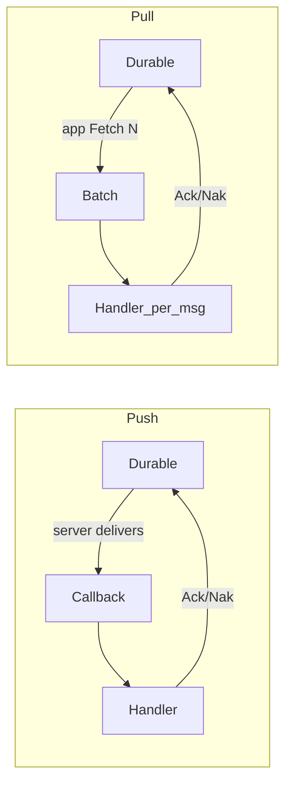

# Push vs Pull

JetStream can **push** messages into your process or let your process **pull** batches. Same stream, same durable ack rules — different control of pacing.

Read [How JetStream works](README.md) first if the durable / Ack model is unfamiliar.

## Flow at a glance



| | Push | Pull |
|-|------|------|
| Who paces delivery? | Server (plus `MaxAckPending` / backpressure) | Your `Fetch` / `Process` loop |
| Latency | Lower | Higher (wait for next fetch) |
| Scale out | Queue group replicas | Multiple puller processes on same durable |
| Worker pool | Recommended for CPU/I/O handlers | Use `WithProcessConcurrency` or horizontal pullers |
| Best for | Always-on services | ETL, bulk, rate-limited ingestion |

## Comparison

| Dimension | Push | Pull |
|-----------|------|------|
| Delivery | Server pushes to client callback | Client fetches batches |
| Latency | Lower (immediate dispatch) | Higher (poll interval) |
| Flow control | `MaxAckPending`, pending limits, backpressure | Batch size, `MaxWaiting`, fetch timeout |
| Horizontal scale | Queue groups (`QueueSubscribe`) | Multiple pullers on same durable |
| Worker pool | `WorkerPoolEnabled: true` recommended | Usually off; or `WithProcessConcurrency` |
| Best for | Always-on services, real-time processing | Batch ETL, rate-limited ingestion, bursty load |

## Push consumers

### When to use push

- Low-latency message handling (milliseconds matter)
- Always-on service with steady or moderate throughput
- CPU-bound handlers that benefit from a worker pool
- Horizontal scaling via queue groups

### Runtime configuration (`RuntimeConsumerConfig`)

```go
cfg.RuntimeConsumer.WorkerPoolEnabled = true
cfg.RuntimeConsumer.WorkerPoolSize = 8           // ~CPU cores or 2× handler concurrency
cfg.RuntimeConsumer.WorkerBufferSize = 256       // burst buffer before backpressure
cfg.RuntimeConsumer.AckWait = 30 * time.Second   // must exceed p99 handler time
cfg.RuntimeConsumer.IdleHeartbeat = 5 * time.Second // non-queue push only; 0 disables
cfg.RuntimeConsumer.FlowControl = true             // pair with IdleHeartbeat
cfg.RuntimeConsumer.PendingMsgLimit = 1000       // NATS client pending message cap
cfg.RuntimeConsumer.PendingMsgBuffer = 10 << 20  // 10 MiB pending bytes cap
```

**Idle heartbeat (push, non-queue):** JetStream sends idle heartbeats when no messages flow. If the client misses them, nats.go reports `ErrConsumerNotActive` (metric `idle_heartbeat_misses`) and the subscription becomes invalid. Use [`SuperviseSubscribeBound`](api-reference.md#subscription-supervisor) (or `Supervise`) to backoff-resubscribe automatically; metrics: `resubscribe_total`, `supervisor_give_up`.

**Queue groups cannot use IdleHeartbeat / FlowControl** (nats.go limitation). For scaled workers use queue groups + `AckWait` / lag metrics, or wrap with `SuperviseQueueSubscribeBound`. Soft liveness for queues is available via [`WatchSoftLiveness`](#queue-soft-liveness).

| Failure mode | Signal | Mitigation |
|--------------|--------|------------|
| Hung handler (no Ack) | Redelivery after `AckWait` | Set `AckWait` > p99 handler; `MaxDeliver`; optional [`WithDLQ`](recipes.md#recipe-g--dead-letter-dlq--subscription-supervisor) |
| Dead / stalled push interest | Idle heartbeat miss → `ErrConsumerNotActive` | `Supervise*` + alert on `idle_heartbeat_misses` / `supervisor_give_up` |
| Backlog while process “alive” | `consumer_stall` / rising `NumPending` | `WatchSoftLiveness` + `FlightRecorder`; `TrackedConsumers` lag |
| Sustained JetStream backlog | `slow_consumer_detected` (pending / lag / ack-pending ratio) | `WatchSlowConsumer` with thresholds |
| Same throughput, much slower handling | `behavior_fingerprint_anomaly` | `WatchBehaviorFingerprint` |

### Durable configuration (push)

```go
libnats.DurableConsumerConfig{
    Durable:       "orders-processor",
    FilterSubject: "orders.>",
    AckPolicy:     libnats.AckExplicit,
    MaxAckPending: 1000,
    AckWait:       30 * time.Second,
    MaxDeliver:    5,
    Heartbeat:     5 * time.Second, // must match RuntimeConsumer.IdleHeartbeat when binding
    FlowControl:   true,            // recommended for high-throughput non-queue push
}
```

### Backpressure (`BackpressureConfig`)

When the worker pool queue is full, `handlePoolBackpressure` applies the configured mode:

| Mode | Constant | Behavior | Use when |
|------|----------|----------|----------|
| Block | `BackpressureBlock` (default) | Block NATS callback until pool has capacity | Strict ordering, no message loss |
| NAK | `BackpressureNak` | NAK immediately; message redelivers | Prefer redelivery over blocking |
| Term | `BackpressureTerm` | Terminal ack; skip message | Poison messages, optional drop |
| Drop | `BackpressureDrop` | Term + log (clears Ack-pending) | Opt-in lossy path only |

```go
cfg.Backpressure = libnats.BackpressureConfig{
    Mode:                     libnats.BackpressureNak,
    MaxAckPending:            1000,
    QueueDepthSampleInterval: 5 * time.Second,
}
```

### Push subscribe patterns

**Single instance (no queue group)**

```go
client.Consumer().Subscribe(ctx, "orders.>", handler,
    nats.BindStream("ORDERS"), nats.Durable("orders-processor"))
```

**Horizontally scaled (queue group)**

```go
client.Consumer().QueueSubscribe(ctx, "orders-workers", "orders.>", handler,
    nats.BindStream("ORDERS"), nats.Durable("orders-processor"))
```

All replicas sharing `orders-workers` compete for messages from the same durable.

### Tuning guide

| Symptom | Adjustment |
|---------|------------|
| Slow handler, growing lag | Increase `WorkerPoolSize`, `WorkerBufferSize` |
| Redeliveries / NAK storms | Increase `AckWait`; fix handler errors |
| Memory pressure | Decrease `PendingMsgBuffer`, `WorkerBufferSize` |
| Pool full, blocked NATS threads | Switch to `BackpressureNak` or increase pool size |
| Hot partitions | Add queue group replicas |

---

## Pull consumers

### When to use pull

- Batch processing (ETL, bulk indexing)
- Explicit rate control (fetch N messages at a time)
- Bursty producers where push would overwhelm the client
- Services that poll on a schedule

### Runtime configuration

```go
cfg.RuntimeConsumer.WorkerPoolEnabled = false  // Process loop is the worker
```

### Durable configuration (pull)

```go
libnats.DurableConsumerConfig{
    Durable:       "orders-puller",
    FilterSubject: "orders.>",
    AckPolicy:     libnats.AckExplicit,
    MaxAckPending: 500,
    AckWait:       60 * time.Second,
    MaxWaiting:  512,   // max concurrent pull requests
}
```

### Fetch and process

```go
pull, _ := client.Consumer().Pull("ORDERS", "orders-puller")

// One-shot batch
msgs, err := pull.Fetch(ctx, 50,
    libnats.WithFetchMaxWait(2*time.Second),
    libnats.WithFetchHeartbeat(500*time.Millisecond), // must be < MaxWait
)

// Continuous loop (IdleHeartbeat from RuntimeConsumer is the default Process HB)
err = pull.Process(ctx, handler,
    libnats.WithFetchBatch(50),
    libnats.WithProcessMaxWait(2*time.Second),
    libnats.WithProcessHeartbeat(500*time.Millisecond), // optional override
)
```

Missed pull heartbeats return `ErrNoHeartbeat` (counted as `idle_heartbeat_misses`); `Process` treats them like fetch timeouts and retries. `Fetch`/`Process` honor `context` cancellation mid-wait via `nats.Context(ctx)`.

### Tuning guide

| Symptom | Adjustment |
|---------|------------|
| High fetch latency | Increase `WithFetchBatch`, decrease `WithProcessMaxWait` |
| Consumer overwhelmed | Decrease batch size |
| Underutilized workers | Increase batch size, add pull replicas |
| Timeouts in metrics | Normal on idle streams; increase `WithProcessMaxWait` |

---

## Decision matrix

| Requirement | Recommendation |
|-------------|----------------|
| Real-time order processing | Push + queue group + worker pool |
| Analytics batch job | Pull + large fetch batch |
| Fan-out to 3 services | Push, 3 durables, `LimitsPolicy` |
| Job queue (one worker per msg) | Push + `WorkQueuePolicy` + queue group |
| Replay historical data | Pull or push with `DeliverByStartSequence` via [Replay](recipes.md#recipe-e--audit--replay) |
| Financial / idempotent processing | Push + `BackpressureBlock` + dedup headers — see [Recipe C](recipes.md#recipe-c--high-consistency--financial-style-processing) |

## Library behavior (both modes)

- **Manual ack:** library adds `ManualAck()` on subscribe; `processMessage` calls `Ack()` on success, `Nak()` on handler error. `ErrDLQRouted` (from `WithDLQ`) skips Ack/Nak after Term.
- **Metrics:** when enabled, records receive count, handling time, ack/nak totals, redeliveries, `resubscribe_total`, `supervisor_give_up`, `consumer_stall`, `slow_consumer_detected`, `behavior_fingerprint_anomaly`.
- **Pull metrics:** `fetch_batch_size`, `fetch_wait_seconds` histograms.

## Queue soft-liveness

Queue groups cannot use JetStream idle heartbeats. Use `WatchSoftLiveness` to periodically call `ConsumerInfo`, compare rising `NumPending` with a last-successful-process timestamp (hooked via `OnProcessSuccess` after Ack / DLQ Term), and emit metric `consumer_stall` plus events when the backlog grows while the process appears alive.

```go
rec := libnats.NewFlightRecorder(128)
supCfg := libnats.SupervisorConfig{MaxRetries: 10}
rec.AttachSupervisor(&supCfg)

sub, _ := client.SuperviseQueueSubscribeBound(ctx,
    "ORDERS", "orders-processor", "orders-workers", "orders.>", handler, supCfg)

liveCfg := libnats.SoftLivenessConfig{
    PollInterval:  2 * time.Second,
    StallAfter:    15 * time.Second,
    RisingWindows: 3,
    CircuitStop:   true, // stop watching after first stall; restart pod if desired
}
rec.AttachSoftLiveness(&liveCfg)
live, _ := client.WatchSoftLiveness(ctx, sub, liveCfg)
defer live.Stop()

// On incident: rec.WriteJSON(os.Stdout) or rec.Snapshot()
```

## Slow consumer detection

`WatchSoftLiveness` detects **stalls** (rising pending without process activity). `WatchSlowConsumer` detects **sustained backlog** against absolute thresholds — useful when the process is still acking but falling behind the stream tip.

Default thresholds (override via `SlowConsumerConfig`):

| Signal | Default |
|--------|---------|
| `NumPending` | `>= 1000` |
| Lag (`LastSeq − Delivered.Stream`) | `>= 1000` |
| `NumAckPending` / `MaxAckPending` | `>= 90%` when `MaxAckPending > 0` |

Thresholds must hold for `SustainFor` (default 30s) before firing. Emits metric `slow_consumer_detected` (separate from backpressure `slow_consumer_events`).

```go
slow, _ := client.WatchSlowConsumer(ctx, sub, libnats.SlowConsumerConfig{
    SustainFor:       30 * time.Second,
    PendingThreshold: 1000,
    LagThreshold:     1000,
    AckPendingRatio:  0.9,
    CircuitStop:      true,
    OnSlow: func(ev libnats.SlowConsumerEvent) {
        // alert / scale / dump recorder
    },
})
defer slow.Stop()
```

Use `EvaluateSlowConsumer` for one-shot checks without a watcher.

## Consumer behavior fingerprinting

`WatchBehaviorFingerprint` learns each worker's normal **msg/min** and **mean handling latency** from `OnMessageHandled` samples (the same path as `message_handling_seconds`). After warmup it fires when throughput stays within `RateTolerance` of baseline while processing latency is at least `LatencyFactor`× baseline for `SustainFor` — e.g. billing-worker still at ~1000 msg/min but 200ms → 2.4s handling.

Default knobs (override via `BehaviorFingerprintConfig`):

| Setting | Default |
|---------|---------|
| `PollInterval` | `5s` |
| `Window` | `60s` |
| `Warmup` | `5m` |
| `MinSamples` | `50` |
| `LatencyFactor` | `3` |
| `RateTolerance` | `±30%` |
| `SustainFor` | `30s` |

Emits metric `behavior_fingerprint_anomaly`. Event payload carries `Normal` / `Current` `BehaviorSnapshot` values for alerts.

When `Client.WatchBehaviorFingerprint` is used, snapshots are also published to JetStream KV bucket `nats_consol_fingerprints` (key `{stream}/{durable}`) so **nats-consol** can show Normal / Current / Anomaly on Consumer Detail. Create the bucket once (`KV().CreateOrUpdate`) or let the worker example do it. Override with `ReportBucket` / `ReportKV` if needed.

```go
_, _ = client.KV().CreateOrUpdate(ctx, libnats.KeyValueConfig{
    Bucket: libnats.DefaultBehaviorFingerprintKVBucket, History: 1,
})
fp, _ := client.WatchBehaviorFingerprint(ctx, sub, libnats.BehaviorFingerprintConfig{
    LatencyFactor: 3,
    RateTolerance: 0.3,
    SustainFor:    30 * time.Second,
    CircuitStop:   true,
    OnAnomaly: func(ev libnats.BehaviorAnomalyEvent) {
        // alert: ev.Normal vs ev.Current (MsgPerMin, Processing)
    },
})
defer fp.Stop()
```

Use `EvaluateBehaviorFingerprint` for pure threshold checks without a watcher.

Pair with:

- `SuperviseQueueSubscribeBound` so invalid interest still resubscribes
- `MetricsConfig.TrackedConsumers` lag alerts
- Non-queue push + `IdleHeartbeat` when a single instance needs HB-based stall detection
- `FlightRecorder` for a dumpable timeline of supervisor / stall / DLQ events
- `WatchSlowConsumer` for threshold-based backlog (vs soft-liveness stall)
- `WatchBehaviorFingerprint` for latency regression at stable throughput

Next: [Configuration recipes](recipes.md) · [Consumer tuning guide](consumer-tuning-guide.md)
