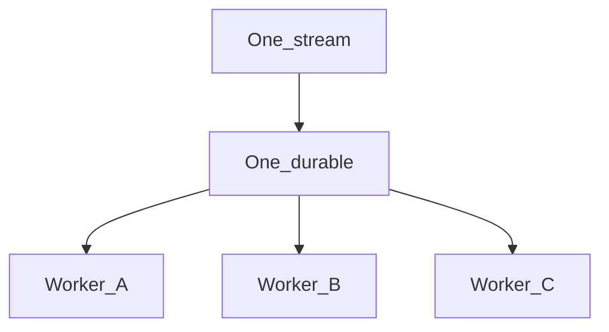
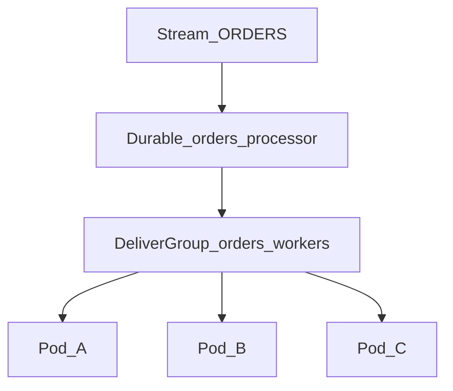

# Scaling JetStream

JetStream does **not** have Kafka-style partitions inside one stream. You scale **publish** with subject design / sharding, and **consume** with more workers on the same durable (queue group or pullers).

Mental model: [How JetStream works](README.md) · Delivery: [Push vs pull](push-vs-pull.md) · Tuning loop: [Consumer tuning guide](consumer-tuning-guide.md).



Same durable + same queue name (push) or multiple pull processes → each message is processed by **one** worker. More workers = more throughput, not fan-out.

## Kubernetes scale does not multiply durables

Scaling a Deployment (more pods) does **not** create more JetStream durables when every replica uses the **same** durable name. The server keeps **one** consumer cursor; the number of connected clients (queue-group members or pullers) grows.

| Knob | Shared across replicas? |
|------|-------------------------|
| Stream | yes |
| Durable name | yes (one cursor) |
| Queue / `DeliverGroup` (push) | yes (same string) |
| Pull durable | yes; no `DeliverGroup` needed |

**Anti-pattern:** unique durable per pod (`orders-processor-$POD_NAME`). That creates many cursors — usually fan-out / duplicate work — not a shared job queue.

```
Deployment replicas: 3
Durable name: "orders-processor"   ← same on every pod
Queue / DeliverGroup: "orders-workers"   ← same on every pod (push)
```

→ 1 durable, 3 workers, messages are load-balanced.

## Comparison

| Approach | Use when | Ordering |
|----------|----------|----------|
| Queue group (push) | Competing workers on one durable | Stream-level |
| Multiple pullers | Batch ingestion | Stream-level |
| Subject sharding | High throughput + per-key order | Per shard |
| Fan-out (multiple durables) | Each service needs every event | Per consumer |

## Queue groups (worker scale)

```go
client.Consumer().QueueSubscribeBound(ctx, "ORDERS", "orders-processor",
    "orders-workers", "orders.>", handler)
```

- Add pods with the same queue name
- Use `WorkQueuePolicy` for job-queue semantics
- See [Optimal setups — job queue](optimal-setups.md#pattern-1-job-queue--competing-workers)

### DeliverGroup (JetStream name for the queue group)

On the server, a **push** durable stores the competing-worker name as `DeliverGroup`. In this library that value is the `queue` argument to `QueueSubscribe` / `QueueSubscribeBound` / `SetupWorker` — not a field on `DurableConsumerConfig` (bind sets it). Raw / consol APIs can set `DeliverGroup` explicitly when creating the consumer.



| Rule | Detail |
|------|--------|
| Same string | Queue subscribe name must equal the consumer’s `DeliverGroup` |
| Shared durable | All replicas bind the same durable name |
| Config stability | Do not change `DeliverGroup` on an existing durable without an intentional recreate |
| Pull | Competing pullers share one durable; they do **not** use `DeliverGroup` |

**Ops notes**

- `MaxAckPending` applies to the **whole** consumer, not per pod — size it for all replicas’ in-flight work.
- On shutdown, drain / unsubscribe so in-flight messages are not stuck until `AckWait`.
- Handlers should be idempotent: after a pod crash, redelivery may land on another replica.

## Pull consumer scale

Multiple processes pull from the same durable; JetStream distributes batches. No `DeliverGroup` — only a shared durable name (see [Kubernetes scale](#kubernetes-scale-does-not-multiply-durables)).

```go
pull.Process(ctx, handler, libnats.WithFetchBatch(100))
```

Tune `MaxWaiting` on the durable for concurrent pull requests.

## Subject sharding (partition-like)

Route by business key to parallel pipelines with per-shard ordering:

```go
shard := libnats.ShardIndex(accountID, 8)
subject := libnats.ShardSubject("orders.shard", accountID, 8, "created")
// → orders.shard.3.created

client.Publisher().PublishJSON(ctx, subject, event)
```

### Stream layout options

**One stream, wildcard capture:**

```go
Subjects: []string{"orders.shard.>"}
```

**Multiple durables per shard** (filter per shard):

```go
FilterSubject: "orders.shard.3.>"
```

**Multiple streams** (`ORDERS_SHARD_0` … `ORDERS_SHARD_7`) for strongest isolation.

## Fan-out (not load sharing)

Separate durables on `LimitsPolicy` — each service gets every message. Do not use queue groups across services.

## Cluster capacity

- `Replicas: 3` for production durability
- `FileStorage` for persistence
- Tune `MaxBytes`, `MaxAge` for retention bounds
- Superclusters / leaf nodes for geo scale — production patterns: [Production operations — Server](devops.md#part-b--nats-server); local gateway lab: [nats-console local Docker — mini supercluster](https://github.com/gopherust-io/nats-console/blob/main/docs/local-docker.md#mini-supercluster-2--2)
- Basic mirror/source streams: set `StreamConfig.Mirror` / `Sources` on `CreateOrUpdateStream` (see [API / StreamConfig](api-reference.md)); leaf-node and multi-account export/import remain upstream NATS ops

## Decision guide

```
Need more workers on same job queue?
  → Queue group + WorkQueuePolicy

Need each service to see all events?
  → LimitsPolicy + separate durables

Need Kafka-like partitions?
  → ShardSubject by key + one consumer (or queue group) per shard

Need batch ETL throughput?
  → Pull + large fetch batches + multiple pullers
```
