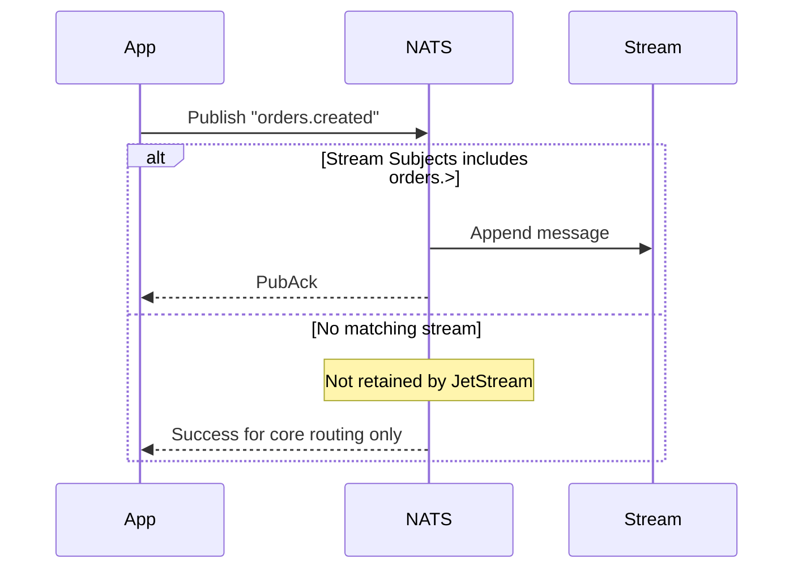

# Streams & Subjects

A JetStream **stream** is durable storage. A **subject** is the routing key on publish. Only messages whose subject matches the stream’s `Subjects` patterns are stored.

For the full publish → store → consume story, see [How JetStream works](README.md).

## Publish → store flow



| Concept | Purpose | Example |
|---------|---------|---------|
| **Publish subject** | Concrete key you publish to | `orders.created` |
| **Stream `Subjects`** | Patterns that capture publishes into storage | `orders.>` |

```go
// Stream captures everything under orders.
Subjects: []string{"orders.>"}

// Stored:   orders.created, orders.order.updated
// Not stored: payments.settled  (unless another stream captures it)
```

## Stream configuration

Prefer provisioning with the `nats` CLI (or platform ops). In code, use `Streams().CreateOrUpdateStream` only when the app intentionally owns bootstrap (labs/examples). `NewClient` does **not** create streams from `cfg.Stream`.

Defined in `libnats.StreamConfig` ([`nats/config.go`](../../nats/config.go)):

```go
_, err := client.Streams().CreateOrUpdateStream(ctx, libnats.StreamConfig{
    Name:        "ORDERS",
    Description: "Order lifecycle events",
    Subjects:    []string{"orders.>"},
    Replicas:    3,
    Storage:     libnats.FileStorage,
    Retention:   libnats.LimitsPolicy,
    MaxAge:      7 * 24 * time.Hour,
    MaxBytes:    10 << 30,
    Discard:     libnats.DiscardOld,
    DuplicateWindow: 2 * time.Minute,
})
```

## Multi-subject streams

Use multiple `Subjects` entries when one stream serves related domains:

```go
Subjects: []string{
    "orders.>",
    "orders.internal.>",
}
```

Prefer a single wildcard (`orders.>`) when all events share a prefix.

## Retention policies

| Policy | Constant | Behavior | Use when |
|--------|----------|----------|----------|
| Limits | `LimitsPolicy` (default) | Messages persist per limits; each consumer tracks its own position | Event log, fan-out, audit |
| Interest | `InterestPolicy` | Messages removed when no consumer interest remains | Ephemeral fan-out |
| Work queue | `WorkQueuePolicy` | Each message delivered to **one** consumer only | Job queues, task workers |

### LimitsPolicy (fan-out / event bus)

Multiple durables on the same stream each receive every message (independent cursor):

```
Publisher → ORDERS stream
              ├── orders-processor  (all messages)
              ├── orders-analytics  (all messages)
              └── orders-audit      (filtered subset)
```

### WorkQueuePolicy (job processing)

Only one consumer receives each message. Ideal for competing workers:

```
Publisher → ORDERS stream (WorkQueue)
              └── orders-processor + queue group "orders-workers"
                    ├── pod-1  ← message A
                    ├── pod-2  ← message B
                    └── pod-3  ← message C
```

**Constraint:** Work-queue streams allow only one consumer with a given filter subject.

## Storage & replication

| Setting | Development | Production |
|---------|-------------|------------|
| `Storage` | `MemoryStorage` | `FileStorage` |
| `Replicas` | `1` | `3` (cluster) |
| `Discard` | `DiscardOld` | `DiscardOld` |

```go
// Development
Storage:  libnats.MemoryStorage,
Replicas: 1,

// Production
Storage:  libnats.FileStorage,
Replicas: 3,
```

`Replicas: 0` defaults to `1` in the library's stream manager.

## Limits & discard

| Field | Purpose |
|-------|---------|
| `MaxAge` | Delete messages older than duration |
| `MaxBytes` | Cap total stream size |
| `MaxMsgs` | Cap message count |
| `MaxMsgSize` | Reject oversized individual messages |
| `Discard` | `DiscardOld` (default) or `DiscardNew` when limits hit |

## Duplicate detection (idempotent publish)

Set `DuplicateWindow` on the stream to enable JetStream deduplication by message ID:

```go
DuplicateWindow: 2 * time.Minute,
```

Publish with deduplication (see [Idempotency](idempotency.md)):

```go
client.Publisher().PublishWithMsgID(ctx, "orders.order.created", messageID, libnats.Message{
    Data: payload, MessageType: libnats.JSON,
})
```

The library uses `PublishMsg` when headers are present, passing the dedup header through to JetStream.

## Stream operations

```go
// Create or update
client.Streams().CreateOrUpdateStream(ctx, streamCfg)

// Inspect
info, _ := client.Streams().StreamInfo(ctx, "ORDERS")

// List
streams, _ := client.Streams().ListStreams(ctx)

// Purge (all or by subject)
client.Streams().PurgeStream(ctx, "ORDERS")
client.Streams().PurgeStream(ctx, "ORDERS", libnats.PurgeSubject("orders.order.created"))

// Delete
client.Streams().DeleteStream(ctx, "ORDERS")

// Read single message by sequence
raw, _ := client.Streams().GetMsg(ctx, "ORDERS", seq)
```

## Design checklist

- [ ] One stream per bounded domain (`ORDERS`, not `ALL_EVENTS`)
- [ ] `Subjects` wildcard covers all publish subjects for that domain
- [ ] Retention policy matches delivery model (fan-out vs work queue)
- [ ] `Replicas` and `Storage` match environment
- [ ] `MaxAge` / `MaxBytes` set for production streams
- [ ] `DuplicateWindow` set when idempotent publish is required
- [ ] Who may publish/subscribe those subjects is defined on the server ([Subject / stream AuthZ](devops.md#4-subject-and-stream-authorization))

Next: [Consumers & binding](consumers-and-binding.md)
